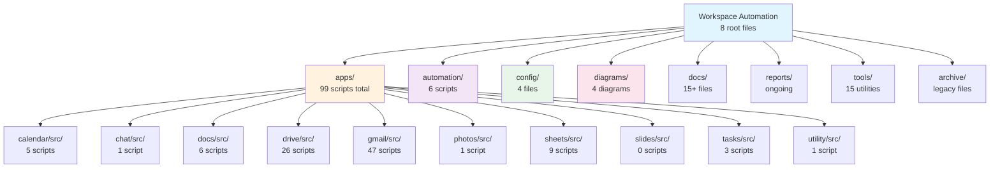
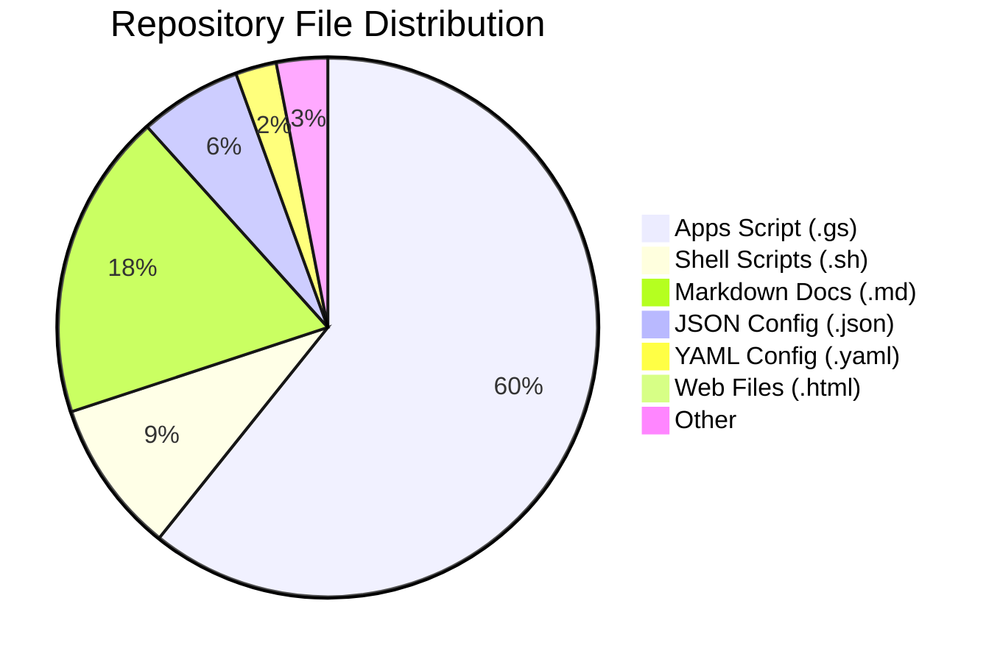
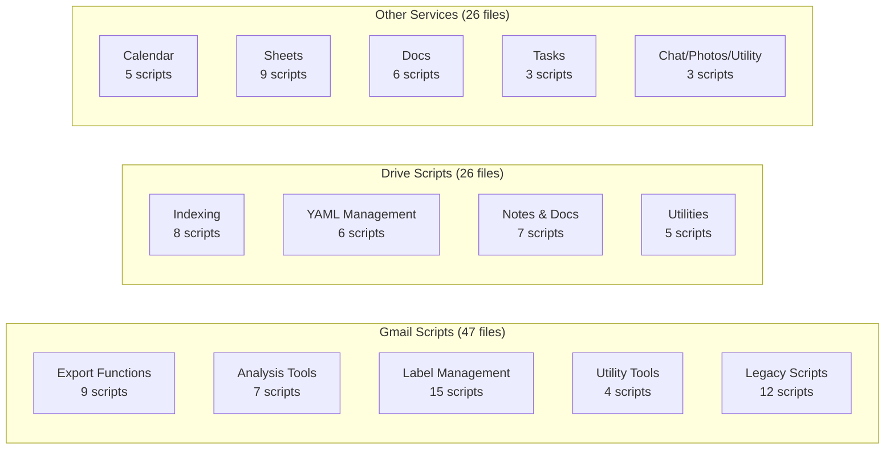
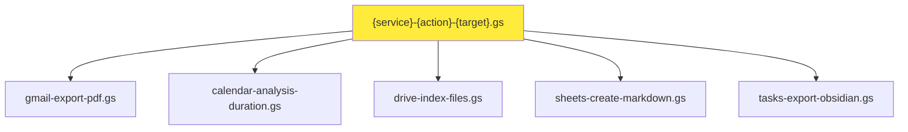

# Vault Structure Preview - Post-Reorganization

## High-Level Folder Structure

```
Workspace-Automation/
├── README.md
├── LICENSE.md
├── package.json
├── .gitignore
│
├── apps/                    # Google Apps Script projects
├── automation/              # Deployment & sync scripts  
├── config/                  # Configuration files
├── diagrams/               # Architecture & structure diagrams
├── docs/                   # Documentation
├── reports/                # Generated reports
├── tools/                  # Development utilities
└── archive/                # Backup & legacy files
```

## Detailed Folder Structure with File Counts



## File Distribution by Type



## Apps Folder Deep Dive



## Key Improvements from Reorganization

1. **Flatter Structure**: Maximum 3 levels deep (was 5+)
2. **Clear Categories**: Each folder has a specific purpose
3. **No Hidden Folders**: All folders visible (except .git, .gitignore)
4. **Gmail Simplified**: From 10+ subdirectories to 1 flat src/ folder
5. **Root Cleaned**: From 20+ files to 8 essential files

## File Naming Patterns

