# Workspace Automation Sequence Diagram

## CI/CD Pipeline Flow

This sequence diagram illustrates the complete workflow from local development to Google Apps Script deployment, showing the interaction between all system components and the timing of operations.

```mermaid
sequenceDiagram
    participant Dev as 👨‍💻 Developer
    participant IDE as VS Code/IDE
    participant Git as Local Git
    participant GH as GitHub Repository
    participant GHA as GitHub Actions
    participant CB as Cloud Build
    participant AR as Artifact Registry
    participant SM as Secret Manager
    participant DI as Docker Image
    participant Clasp as Clasp CLI
    participant GAS1 as Calendar Project
    participant GAS2 as Gmail Project
    participant GAS3 as Drive Project
    participant GASN as ... (7 more projects)
    participant WS as Google Workspace APIs

    Note over Dev, WS: Workspace Automation CI/CD Pipeline Flow

    %% Development Phase
    rect rgb(230, 245, 255)
        Note over Dev, Git: Local Development Phase
        Dev->>IDE: Opens project in VS Code
        Dev->>IDE: Edits .gs scripts in projects/gmail/
        Dev->>IDE: Updates automation logic
        IDE->>Git: Stages changes (git add .)
        Git->>Git: Creates commit with changes
        Dev->>Git: git commit -m "feat: update gmail automation"
        Dev->>Git: git push origin main
    end

    %% GitHub Integration
    rect rgb(243, 229, 245)
        Note over Git, GHA: GitHub Integration Phase
        Git->>GH: Pushes commits to main branch
        GH->>GH: Receives push event
        GH->>GHA: Triggers GitHub Actions (optional)
        GH->>CB: Triggers Cloud Build via webhook
    end

    %% Cloud Build Phase
    rect rgb(255, 243, 224)
        Note over CB, DI: Cloud Build Execution Phase
        CB->>CB: Receives build trigger
        CB->>GH: Fetches source code
        CB->>AR: Pulls custom clasp-builder image
        AR->>CB: Returns Docker image
        CB->>DI: Starts container with Node.js + gcloud
        
        Note over DI: Container Initialization
        DI->>DI: Sets up build environment
        DI->>DI: npm install -g @google/clasp
        DI->>SM: Requests clasp-credentials secret
        SM->>DI: Returns OAuth tokens
        DI->>DI: Creates ~/.clasprc.json
    end

    %% Authentication & Validation
    rect rgb(232, 245, 233)
        Note over DI, Clasp: Authentication & Validation Phase
        DI->>Clasp: clasp login --status
        Clasp->>Clasp: Validates OAuth tokens
        Clasp-->>DI: Authentication successful
        
        DI->>DI: Validates project directories
        DI->>DI: Checks .clasp.json files
        DI->>DI: Verifies script IDs
    end

    %% Deployment Phase
    rect rgb(252, 228, 236)
        Note over DI, GASN: Multi-Project Deployment Phase
        
        loop For each of 10 projects
            DI->>DI: cd projects/calendar
            DI->>Clasp: clasp push --force
            Clasp->>GAS1: Deploys scripts to Calendar project
            GAS1-->>Clasp: Deployment success/failure
            Clasp-->>DI: Returns deployment status
            
            DI->>DI: cd projects/gmail  
            DI->>Clasp: clasp push --force
            Clasp->>GAS2: Deploys scripts to Gmail project
            GAS2-->>Clasp: Deployment success/failure
            Clasp-->>DI: Returns deployment status
            
            DI->>DI: cd projects/drive
            DI->>Clasp: clasp push --force
            Clasp->>GAS3: Deploys scripts to Drive project
            GAS3-->>Clasp: Deployment success/failure
            Clasp-->>DI: Returns deployment status
            
            Note over DI, GASN: ... Continues for remaining 7 projects
            DI->>Clasp: Deploy to Tasks, Docs, Sheets, etc.
            Clasp->>GASN: Deploy to remaining projects
            GASN-->>Clasp: All deployment statuses
            Clasp-->>DI: Aggregated deployment results
        end
    end

    %% Google Workspace Integration
    rect rgb(241, 248, 233)
        Note over GAS1, WS: Google Workspace Integration Phase
        GAS1->>WS: Connects to Calendar API
        GAS2->>WS: Connects to Gmail API  
        GAS3->>WS: Connects to Drive API
        GASN->>WS: Connects to other Workspace APIs
        WS-->>GAS1: API responses and data
        WS-->>GAS2: API responses and data
        WS-->>GAS3: API responses and data
        WS-->>GASN: API responses and data
    end

    %% Completion & Reporting
    rect rgb(255, 248, 225)
        Note over DI, Dev: Completion & Reporting Phase
        DI->>DI: Aggregates deployment results
        DI->>DI: Generates deployment summary
        
        alt All deployments successful
            DI->>CB: Reports: "🎉 ALL DEPLOYMENTS COMPLETED SUCCESSFULLY!"
            CB->>GH: Updates build status: SUCCESS
            GH->>Dev: Sends success notification
        else Some deployments failed
            DI->>CB: Reports: "❌ Failed deployments: [project list]"
            CB->>GH: Updates build status: FAILURE
            GH->>Dev: Sends failure notification with error details
        end
        
        CB->>CB: Logs build completion
        CB->>Dev: Build complete notification
    end

    %% Error Handling
    rect rgb(255, 235, 238)
        Note over CB, Dev: Error Handling Scenarios
        
        alt Authentication failure
            DI->>SM: Invalid/expired credentials
            SM-->>DI: Authentication error
            DI->>CB: Reports authentication failure
            CB->>Dev: Notifies developer to update credentials
        else Project configuration error
            DI->>GAS1: Invalid script ID in .clasp.json
            GAS1-->>DI: Project not found error
            DI->>CB: Reports configuration error
            CB->>Dev: Notifies developer to fix project configuration
        else Build environment failure
            DI->>DI: npm install fails
            DI->>CB: Reports build environment error
            CB->>Dev: Notifies developer of infrastructure issue
        end
    end

    Note over Dev, WS: End of Automation Pipeline
```

## Sequence Flow Breakdown

### Phase 1: Local Development (Blue)
**Timing**: 1-5 minutes
- Developer edits scripts in VS Code
- Git staging and commit process
- Push to GitHub repository

### Phase 2: GitHub Integration (Purple)
**Timing**: 10-30 seconds
- GitHub receives push event
- Triggers Cloud Build webhook
- Optional GitHub Actions activation

### Phase 3: Cloud Build Execution (Orange)
**Timing**: 2-5 minutes
- Container initialization and setup
- Custom Docker image deployment
- Environment configuration

### Phase 4: Authentication & Validation (Green)
**Timing**: 30-60 seconds
- OAuth token validation
- Project configuration verification
- Script ID validation

### Phase 5: Multi-Project Deployment (Pink)
**Timing**: 3-8 minutes
- Sequential deployment to all 10 projects
- Individual project success/failure tracking
- Aggregated results compilation

### Phase 6: Google Workspace Integration (Light Green)
**Timing**: Ongoing
- Apps Script projects connect to Workspace APIs
- Real-time data processing and automation

### Phase 7: Completion & Reporting (Yellow)
**Timing**: 10-30 seconds
- Deployment summary generation
- Success/failure notifications
- Developer feedback delivery

### Error Handling Scenarios (Light Red)
**Various Timings**: 30 seconds - 2 minutes
- Authentication failures
- Configuration errors
- Build environment issues

## Key Timing Characteristics

**Total Pipeline Duration**: 6-18 minutes (typical: 8-12 minutes)
- Fast path (no changes): 6-8 minutes
- Standard deployment: 8-12 minutes
- With errors/retries: 12-18 minutes

**Critical Path Dependencies**:
1. Docker image availability (affects build time)
2. Secret Manager response time (affects authentication)
3. Number of scripts per project (affects deployment time)
4. Google Apps Script API rate limits (affects concurrent deployments)

**Parallelization Opportunities**:
- Project deployments could be parallelized
- Docker image pre-warming
- Secret pre-fetching

This sequence diagram provides a comprehensive view of the temporal relationships and dependencies in the Workspace Automation pipeline.
