# Workspace Automation System Architecture

## System Design Blueprint

This diagram visualizes the complete user flow from local Mac development to Google Apps Script deployment, showing all connected tools, services, and automations.

```mermaid
graph TB
    %% Developer Environment
    subgraph "Local Development Environment"
        DEV[👨‍💻 Developer on Mac]
        IDE[VS Code / IDE]
        GIT[Git Repository]
        CLASP[Clasp CLI]
        DEV --> IDE
        IDE --> GIT
        IDE --> CLASP
    end

    %% GitHub Environment
    subgraph "GitHub Repository"
        REPO[Another-Google-Automation-Repo]
        MAIN[main branch]
        PR[Pull Requests]
        ACTIONS[GitHub Actions]
        REPO --> MAIN
        REPO --> PR
        REPO --> ACTIONS
    end

    %% Google Cloud Platform
    subgraph "Google Cloud Platform"
        subgraph "Cloud Build"
            TRIGGER[Build Trigger]
            BUILDER[Custom Docker Image]
            PIPELINE[Build Pipeline]
            TRIGGER --> BUILDER
            BUILDER --> PIPELINE
        end
        
        subgraph "Artifact Registry"
            REGISTRY[clasp-builder Image]
            REGISTRY_PATH[us-central1-docker.pkg.dev/...]
            REGISTRY --> REGISTRY_PATH
        end
        
        subgraph "Secret Manager"
            SECRETS[clasp-credentials]
            AUTH_TOKEN[OAuth Tokens]
            SECRETS --> AUTH_TOKEN
        end
        
        subgraph "IAM & Security"
            SA[Service Accounts]
            ROLES[IAM Roles]
            WIF[Workload Identity Federation]
            SA --> ROLES
            SA --> WIF
        end
    end

    %% Google Apps Script Projects
    subgraph "Google Apps Script Platform"
        subgraph "Service Projects"
            CALENDAR_PROJ[Calendar Project<br/>1WBzQgskRgRP...]
            GMAIL_PROJ[Gmail Project<br/>1MhC1spUX-j1H...]
            DRIVE_PROJ[Drive Project<br/>1Y62ucpYOhuh...]
            DOCS_PROJ[Docs Project<br/>16U33iZkZSoN...]
            SHEETS_PROJ[Sheets Project<br/>1HfBP6a8zJ7pi...]
            SLIDES_PROJ[Slides Project<br/>1qWMrnFNy3b_Y...]
            TASKS_PROJ[Tasks Project<br/>1GtzgEyKr39SN...]
            CHAT_PROJ[Chat Project<br/>1j9M60-KeKOM...]
            PHOTOS_PROJ[Photos Project<br/>1bkbORqQD2is7...]
            UTILITY_PROJ[Utility Project<br/>1X3W2-mJ5ss_2...]
        end
    end

    %% Google Workspace Services
    subgraph "Google Workspace Services"
        GMAIL[Gmail API]
        GCAL[Google Calendar API]
        GDRIVE[Google Drive API]
        GDOCS[Google Docs API]
        GSHEETS[Google Sheets API]
        GSLIDES[Google Slides API]
        GTASKS[Google Tasks API]
        GCHAT[Google Chat API]
        GPHOTOS[Google Photos API]
    end

    %% Project Directories
    subgraph "Local Project Structure"
        PROJ_CAL[apps/calendar/]
        PROJ_GMAIL[apps/gmail/]
        PROJ_DRIVE[apps/drive/]
        PROJ_DOCS[apps/docs/]
        PROJ_SHEETS[apps/sheets/]
        PROJ_SLIDES[apps/slides/]
        PROJ_TASKS[apps/tasks/]
        PROJ_CHAT[apps/chat/]
        PROJ_PHOTOS[apps/photos/]
        PROJ_UTILITY[apps/utility/]
    end

    %% Development Flow
    GIT --> REPO
    REPO --> TRIGGER
    TRIGGER --> PIPELINE
    PIPELINE --> SECRETS
    PIPELINE --> REGISTRY

    %% Deployment Flow
    PIPELINE --> CALENDAR_PROJ
    PIPELINE --> GMAIL_PROJ
    PIPELINE --> DRIVE_PROJ
    PIPELINE --> DOCS_PROJ
    PIPELINE --> SHEETS_PROJ
    PIPELINE --> SLIDES_PROJ
    PIPELINE --> TASKS_PROJ
    PIPELINE --> CHAT_PROJ
    PIPELINE --> PHOTOS_PROJ
    PIPELINE --> UTILITY_PROJ

    %% Service Connections
    CALENDAR_PROJ --> GCAL
    GMAIL_PROJ --> GMAIL
    DRIVE_PROJ --> GDRIVE
    DOCS_PROJ --> GDOCS
    SHEETS_PROJ --> GSHEETS
    SLIDES_PROJ --> GSLIDES
    TASKS_PROJ --> GTASKS
    CHAT_PROJ --> GCHAT
    PHOTOS_PROJ --> GPHOTOS

    %% Local to Service Mapping
    PROJ_CAL -.-> CALENDAR_PROJ
    PROJ_GMAIL -.-> GMAIL_PROJ
    PROJ_DRIVE -.-> DRIVE_PROJ
    PROJ_DOCS -.-> DOCS_PROJ
    PROJ_SHEETS -.-> SHEETS_PROJ
    PROJ_SLIDES -.-> SLIDES_PROJ
    PROJ_TASKS -.-> TASKS_PROJ
    PROJ_CHAT -.-> CHAT_PROJ
    PROJ_PHOTOS -.-> PHOTOS_PROJ
    PROJ_UTILITY -.-> UTILITY_PROJ

    %% Authentication Flow
    WIF --> ACTIONS
    SA --> PIPELINE
    AUTH_TOKEN --> CALENDAR_PROJ
    AUTH_TOKEN --> GMAIL_PROJ
    AUTH_TOKEN --> DRIVE_PROJ
    AUTH_TOKEN --> DOCS_PROJ
    AUTH_TOKEN --> SHEETS_PROJ
    AUTH_TOKEN --> SLIDES_PROJ
    AUTH_TOKEN --> TASKS_PROJ
    AUTH_TOKEN --> CHAT_PROJ
    AUTH_TOKEN --> PHOTOS_PROJ
    AUTH_TOKEN --> UTILITY_PROJ

    %% Styling
    classDef devEnv fill:#e1f5fe
    classDef github fill:#f3e5f5
    classDef gcp fill:#fff3e0
    classDef gas fill:#e8f5e8
    classDef workspace fill:#fce4ec
    classDef local fill:#f1f8e9

    class DEV,IDE,GIT,CLASP devEnv
    class REPO,MAIN,PR,ACTIONS github
    class TRIGGER,BUILDER,PIPELINE,REGISTRY,REGISTRY_PATH,SECRETS,AUTH_TOKEN,SA,ROLES,WIF gcp
    class CALENDAR_PROJ,GMAIL_PROJ,DRIVE_PROJ,DOCS_PROJ,SHEETS_PROJ,SLIDES_PROJ,TASKS_PROJ,CHAT_PROJ,PHOTOS_PROJ,UTILITY_PROJ gas
    class GMAIL,GCAL,GDRIVE,GDOCS,GSHEETS,GSLIDES,GTASKS,GCHAT,GPHOTOS workspace
    class PROJ_CAL,PROJ_GMAIL,PROJ_DRIVE,PROJ_DOCS,PROJ_SHEETS,PROJ_SLIDES,PROJ_TASKS,PROJ_CHAT,PROJ_PHOTOS,PROJ_UTILITY local
```

## Architecture Components

### Development Flow
1. **Local Development**: Developer writes scripts in VS Code/IDE
2. **Version Control**: Git commits and pushes to GitHub repository
3. **CI/CD Trigger**: GitHub push triggers Cloud Build pipeline
4. **Authentication**: Workload Identity Federation and service accounts handle security
5. **Deployment**: Custom Docker image deploys scripts to all 10 Google Apps Script projects

### Key Infrastructure
- **Custom Docker Image**: `us-central1-docker.pkg.dev/workspace-automation-466800/clasp-builder/clasp-builder:latest`
- **Secret Management**: OAuth tokens stored securely in Google Cloud Secret Manager
- **Project Mapping**: Each local directory maps directly to a specific Google Apps Script project
- **Service Integration**: Each Apps Script project connects to its corresponding Google Workspace API

### Data Flow Patterns
- **Solid Lines**: Direct execution and deployment flows
- **Dotted Lines**: Logical mapping relationships between local directories and cloud projects
- **Color Coding**: Different environments and service types for visual clarity

This blueprint demonstrates the complete automation pipeline from local development to production Google Workspace services.
