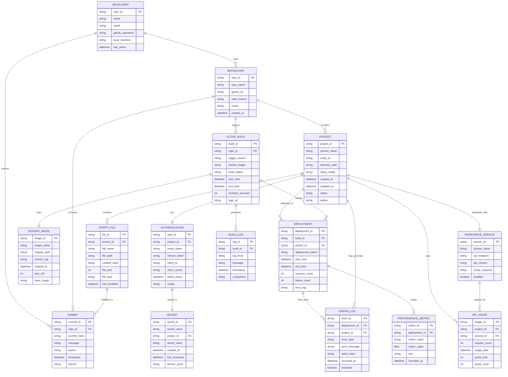

# Workspace Automation Entity Relationship Diagram

## Data Model Overview

This ERD represents the complete data model for the Workspace Automation project, showing relationships between developers, repositories, cloud infrastructure, Google Apps Script projects, and Google Workspace services.

## Entity Descriptions

### Core Entities

**PROJECT**: Represents each Google Apps Script project (Calendar, Gmail, Drive, etc.)
- Links to Google Apps Script project IDs
- Tracks deployment status and configuration
- Maps to local directory structure

**DEVELOPER**: User information and access tracking
- GitHub integration and local machine identification
- Activity monitoring and access control

**AUTHENTICATION**: OAuth and security credentials
- Secure token management for Google APIs
- Integration with Google Cloud Secret Manager

### Infrastructure Entities

**REPOSITORY**: GitHub repository management
- Version control and branch tracking
- Integration with Cloud Build triggers

**CLOUD_BUILD**: Build pipeline tracking
- Docker image management and build status
- Performance metrics and logging

**DEPLOYMENT**: Deployment execution tracking
- Success/failure rates per project
- Error logging and troubleshooting

### Service Integration

**WORKSPACE_SERVICE**: Google Workspace API definitions
- Service endpoints and scope requirements
- API quota and usage tracking

**SCRIPT_FILE**: Individual script file tracking
- File versioning and content hashing
- Deployment synchronization

### Monitoring and Analytics

**BUILD_LOG**: Detailed build process logging
- Component-level debugging information
- Performance optimization data

**ERROR_LOG**: Comprehensive error tracking
- Stack traces and resolution status
- Project-specific error patterns

**PERFORMANCE_METRIC**: System performance monitoring
- Build duration and deployment efficiency
- Resource utilization tracking

## Data Relationships

### Primary Flows
1. **Development Flow**: DEVELOPER → REPOSITORY → COMMIT → CLOUD_BUILD → DEPLOYMENT
2. **Authentication Flow**: DEVELOPER → AUTHENTICATION → SECRET → PROJECT
3. **Service Integration**: PROJECT → WORKSPACE_SERVICE → API_USAGE
4. **Monitoring Flow**: DEPLOYMENT → PERFORMANCE_METRIC + ERROR_LOG

### Key Constraints
- Each PROJECT has exactly one AUTHENTICATION configuration
- Each PROJECT integrates with exactly one WORKSPACE_SERVICE
- DEPLOYMENTS can have multiple ERROR_LOGs and PERFORMANCE_METRICs
- REPOSITORIES can trigger multiple CLOUD_BUILDs over time

This data model supports comprehensive tracking, monitoring, and analytics for the entire Workspace Automation ecosystem.
