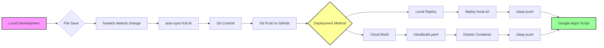
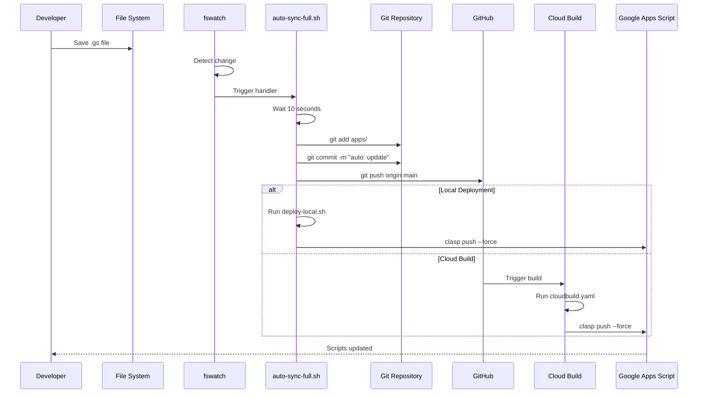
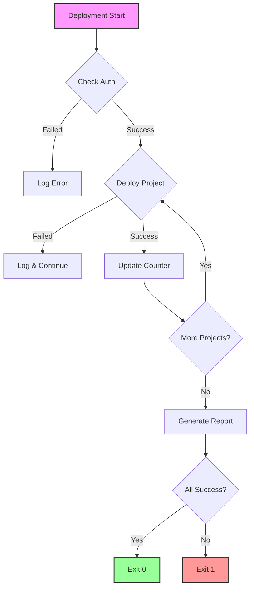

# Deployment Flow Diagram

## Overview
This document visualizes the deployment pipeline from local development to Google Apps Script.

## Deployment Flow

## Detailed Process Flow

## Component Details

### File Watcher (`fswatch`)
- Monitors: `*.gs`, `*.json`, `*.html`, `*.js` files
- Excludes: `.git`, `node_modules`, `*.log`
- Location: `/apps` directory

### Auto-sync Script
- **Debounce**: 10-second delay after last change
- **Actions**: 
  1. Stage changes
  2. Create descriptive commit
  3. Push to GitHub
  4. Deploy to Apps Script

### Deployment Methods

#### Local Deployment (Current)
- Uses `deploy-local.sh`
- Requires local clasp authentication
- Direct push to Google Apps Script

#### Cloud Build (Future)
- Uses `cloudbuild.yaml`
- Runs in Google Cloud
- Requires fixing Docker permissions

## Error Handling

## Deployment Status Indicators

| Symbol | Meaning |
|--------|---------|
| 🚀 | Deployment starting |
| ✅ | Deployment successful |
| ❌ | Deployment failed |
| ⚠️ | Warning/Skipped |
| 📦 | Processing project |
| 🔐 | Authentication check |
| 📊 | Summary report |