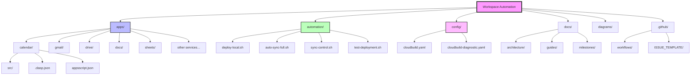

# Repository Structure

## Directory Tree

```
workspace-automation/
├── apps/                      # Google Apps Script projects
│   ├── calendar/             # Calendar automation scripts
│   │   ├── src/             # Script source files
│   │   ├── .clasp.json      # Project configuration
│   │   └── appsscript.json  # Manifest file
│   ├── chat/                # Chat automation scripts
│   ├── docs/                # Docs automation scripts
│   ├── drive/               # Drive automation scripts
│   ├── gmail/               # Gmail automation scripts
│   ├── photos/              # Photos automation scripts
│   ├── sheets/              # Sheets automation scripts
│   ├── slides/              # Slides automation scripts
│   ├── tasks/               # Tasks automation scripts
│   └── utility/             # Utility scripts
├── automation/              # Automation and deployment scripts
│   ├── deploy-local.sh     # Local deployment script
│   ├── auto-sync-full.sh   # File watcher with auto-deploy
│   ├── sync-control.sh     # Sync process control
│   └── test-deployment.sh  # Deployment testing
├── config/                  # Configuration files
│   ├── cloudbuild.yaml     # Cloud Build configuration
│   └── cloudbuild-diagnostic.yaml
├── docs/                    # Documentation
│   ├── architecture/       # Architecture documentation
│   ├── guides/            # How-to guides
│   └── milestones/        # Project milestones
├── diagrams/               # Architecture diagrams
├── .github/                # GitHub configuration
│   ├── workflows/         # GitHub Actions workflows
│   └── ISSUE_TEMPLATE/    # Issue templates
└── archive/               # Archived files

```

## Mermaid.js Diagram



## Key Directories

### `/apps`
Contains all Google Apps Script projects organized by service. Each project has:
- `src/` - Script source files (.gs, .html, .js)
- `.clasp.json` - Project configuration with script ID
- `appsscript.json` - Manifest with dependencies and permissions

### `/automation`
Shell scripts for deployment and synchronization:
- **deploy-local.sh** - Deploys all projects using local clasp
- **auto-sync-full.sh** - Watches for file changes and auto-deploys
- **sync-control.sh** - Controls the sync process
- **test-deployment.sh** - Validates deployment configuration

### `/config`
Cloud Build and CI/CD configuration files

### `/docs`
Project documentation organized by type:
- **architecture/** - System design and architecture docs
- **guides/** - How-to guides and tutorials
- **milestones/** - Project planning and progress

### `/diagrams`
Architecture and flow diagrams using Mermaid.js

### `/.github`
GitHub-specific configuration:
- **workflows/** - GitHub Actions for CI/CD
- **ISSUE_TEMPLATE/** - Issue and PR templates

## File Naming Conventions

- **Scripts**: `service-function-description.gs`
  - Example: `gmail-filter-manager.gs`
- **Documentation**: `UPPERCASE_TOPIC.md`
  - Example: `ARCHITECTURE.md`
- **Config files**: `lowercase-with-dashes.yaml`
  - Example: `cloudbuild-diagnostic.yaml`

## Future Growth Structure

The repository is organized to support:
1. **New Google Services** - Add new folders under `/apps`
2. **Gemini Integration** - Add `/apps/gemini` when ready
3. **GCP Services** - Add `/gcp` for Cloud Functions, Pub/Sub, etc.
4. **Testing** - Add `/tests` for automated testing
5. **Packages** - Add `/packages` for shared libraries