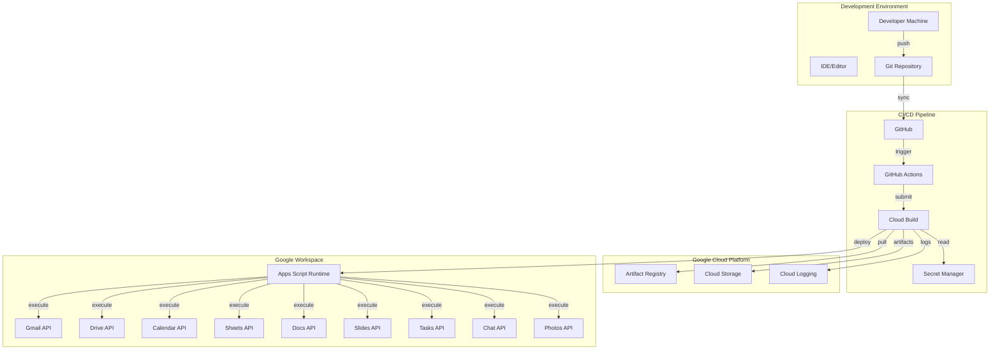
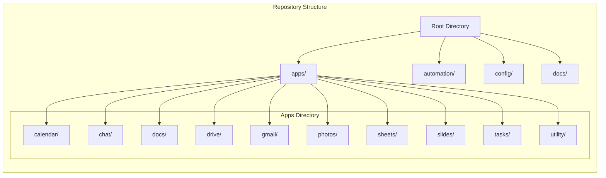
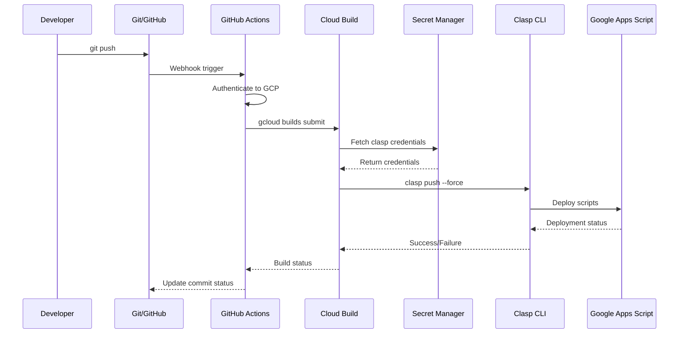
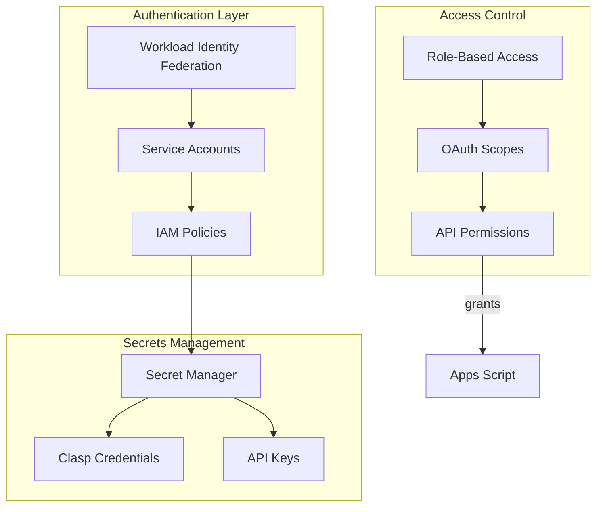
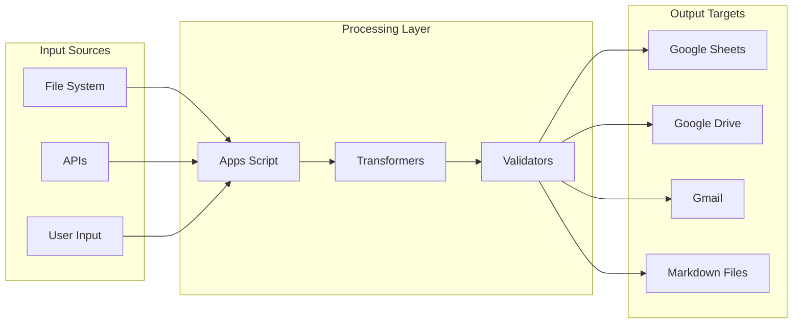

# System Architecture Diagram

## High-Level Architecture

```mermaid
graph TB
    subgraph "Development Environment"
        DEV[Developer Machine]
        IDE[IDE/Editor]
        GIT[Git Repository]
    end
    
    subgraph "CI/CD Pipeline"
        GH[GitHub]
        GHA[GitHub Actions]
        CB[Cloud Build]
        SM[Secret Manager]
    end
    
    subgraph "Google Cloud Platform"
        GAR[Artifact Registry]
        GCS[Cloud Storage]
        LOG[Cloud Logging]
    end
    
    subgraph "Google Workspace"
        GAS[Apps Script Runtime]
        GM[Gmail API]
        GD[Drive API]
        GC[Calendar API]
        GSH[Sheets API]
        GDO[Docs API]
        GSL[Slides API]
        GT[Tasks API]
        GCH[Chat API]
        GP[Photos API]
    end
    
    DEV -->|push| GIT
    GIT -->|sync| GH
    GH -->|trigger| GHA
    GHA -->|submit| CB
    CB -->|read| SM
    CB -->|pull| GAR
    CB -->|deploy| GAS
    CB -->|logs| LOG
    CB -->|artifacts| GCS
    
    GAS -->|execute| GM
    GAS -->|execute| GD
    GAS -->|execute| GC
    GAS -->|execute| GSH
    GAS -->|execute| GDO
    GAS -->|execute| GSL
    GAS -->|execute| GT
    GAS -->|execute| GCH
    GAS -->|execute| GP
```

## Component Architecture

```mermaid
graph LR
    subgraph "Repository Structure"
        ROOT[Root Directory]
        APPS[apps/]
        AUTO[automation/]
        CONFIG[config/]
        DOCS[docs/]
        
        ROOT --> APPS
        ROOT --> AUTO
        ROOT --> CONFIG
        ROOT --> DOCS
        
        subgraph "Apps Directory"
            CAL[calendar/]
            CHAT[chat/]
            DOC[docs/]
            DRV[drive/]
            GML[gmail/]
            PHO[photos/]
            SHT[sheets/]
            SLD[slides/]
            TSK[tasks/]
            UTL[utility/]
        end
        
        APPS --> CAL
        APPS --> CHAT
        APPS --> DOC
        APPS --> DRV
        APPS --> GML
        APPS --> PHO
        APPS --> SHT
        APPS --> SLD
        APPS --> TSK
        APPS --> UTL
    end
```

## Deployment Architecture

```mermaid
sequenceDiagram
    participant Dev as Developer
    participant Git as Git/GitHub
    participant GHA as GitHub Actions
    participant CB as Cloud Build
    participant SM as Secret Manager
    participant Clasp as Clasp CLI
    participant GAS as Google Apps Script
    
    Dev->>Git: git push
    Git->>GHA: Webhook trigger
    GHA->>GHA: Authenticate to GCP
    GHA->>CB: gcloud builds submit
    CB->>SM: Fetch clasp credentials
    SM-->>CB: Return credentials
    CB->>Clasp: clasp push --force
    Clasp->>GAS: Deploy scripts
    GAS-->>Clasp: Deployment status
    Clasp-->>CB: Success/Failure
    CB-->>GHA: Build status
    GHA-->>Git: Update commit status
```

## Security Architecture

```mermaid
graph TB
    subgraph "Authentication Layer"
        WIF[Workload Identity Federation]
        SA[Service Accounts]
        IAM[IAM Policies]
    end
    
    subgraph "Secrets Management"
        SM[Secret Manager]
        CLASP[Clasp Credentials]
        API[API Keys]
    end
    
    subgraph "Access Control"
        RBAC[Role-Based Access]
        SCOPE[OAuth Scopes]
        PERM[API Permissions]
    end
    
    WIF --> SA
    SA --> IAM
    IAM --> SM
    SM --> CLASP
    SM --> API
    
    RBAC --> SCOPE
    SCOPE --> PERM
    PERM --> |grants| GAS[Apps Script]
```

## Data Flow Architecture

```mermaid
graph LR
    subgraph "Input Sources"
        FS[File System]
        API[APIs]
        UI[User Input]
    end
    
    subgraph "Processing Layer"
        AS[Apps Script]
        TF[Transformers]
        VAL[Validators]
    end
    
    subgraph "Output Targets"
        GS[Google Sheets]
        GD[Google Drive]
        GM[Gmail]
        MD[Markdown Files]
    end
    
    FS --> AS
    API --> AS
    UI --> AS
    
    AS --> TF
    TF --> VAL
    
    VAL --> GS
    VAL --> GD
    VAL --> GM
    VAL --> MD
```