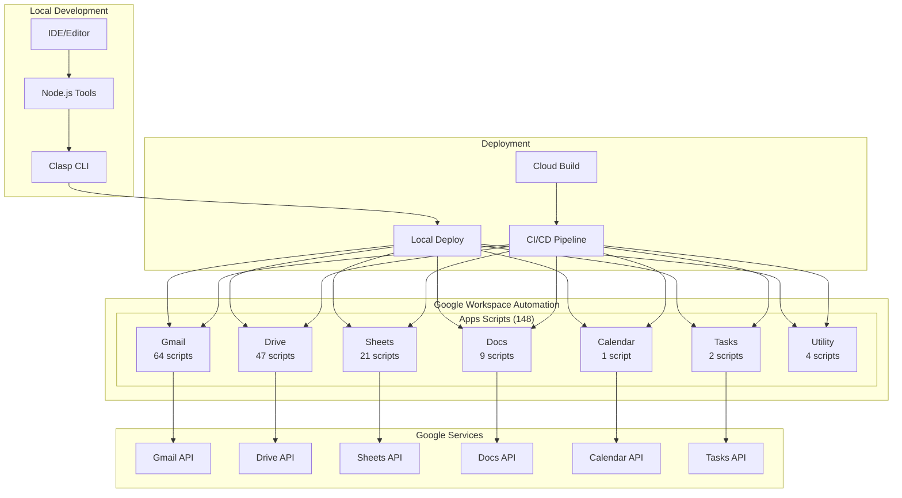
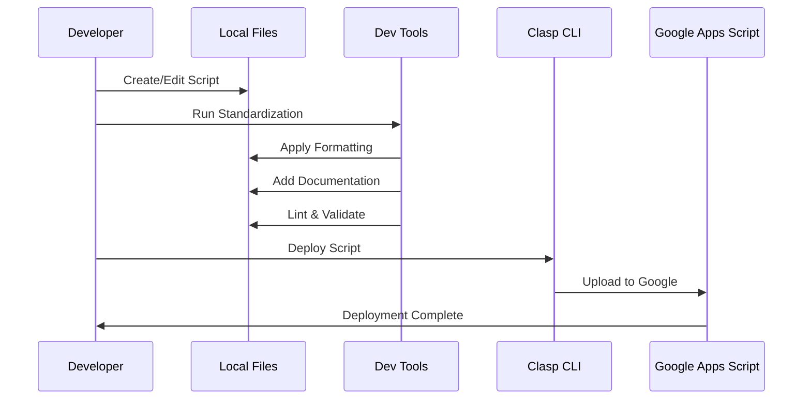
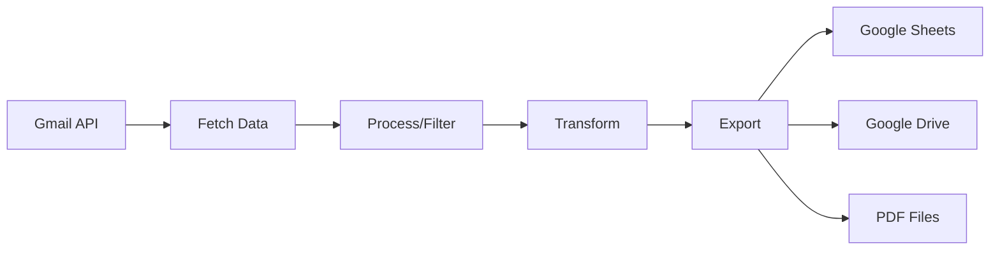
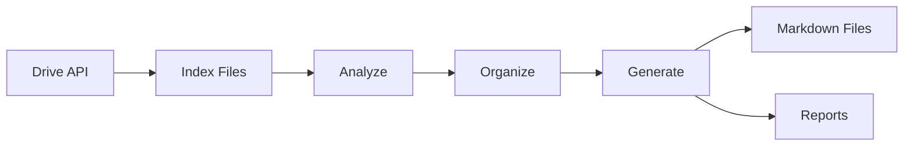

# Architecture Overview

## System Architecture



## Script Organization

```
workspace-automation/
│
├── apps/                    # Main scripts directory
│   ├── calendar/           # Calendar automation
│   │   └── src/
│   │       └── analyze-duration-distance.gs
│   │
│   ├── docs/              # Document automation
│   │   └── src/
│   │       ├── embed-content-block.gs
│   │       ├── export-docs-*.gs (4 files)
│   │       ├── format-*.gs (2 files)
│   │       └── markdown-export-*.gs (4 files)
│   │
│   ├── drive/             # Drive automation (largest)
│   │   └── src/
│   │       ├── File Operations (15 scripts)
│   │       ├── Folder Operations (8 scripts)
│   │       ├── Markdown Operations (20 scripts)
│   │       └── Utility Scripts (4 scripts)
│   │
│   ├── gmail/             # Gmail automation (most scripts)
│   │   └── src/
│   │       ├── Analysis Scripts (10 scripts)
│   │       ├── Export Scripts (15 scripts)
│   │       ├── Label Management (20 scripts)
│   │       ├── Email Processing (15 scripts)
│   │       └── Utility Scripts (4 scripts)
│   │
│   ├── sheets/            # Spreadsheet automation
│   │   └── src/
│   │       ├── Data Processing (8 scripts)
│   │       ├── Import/Export (7 scripts)
│   │       ├── Formatting (4 scripts)
│   │       └── Utility Scripts (2 scripts)
│   │
│   ├── tasks/             # Task management
│   │   └── src/
│   │       ├── export-tasks-obsidian.gs
│   │       └── list-task-ids.gs
│   │
│   └── utility/           # Cross-service utilities
│       └── src/
│           ├── add-yaml-frontmatter.gs
│           ├── check-api-key.gs
│           ├── fetch-api-key.gs
│           └── update-obsidian-vault-config.gs
```

## Naming Convention Architecture

### Action-Noun Pattern

```
[action]-[target]-[modifier].gs

Examples:
├── export-labels.gs              # Simple action-noun
├── export-labels-to-sheets.gs    # With target modifier
├── markdown-export-docs.gs       # Markdown prefix exception
└── analyze-email-stats.gs        # Clear action and target
```

### Service Organization

```
No Service Prefix Needed:
❌ gmail-export-labels.gs    (redundant - in gmail folder)
✅ export-labels.gs          (service clear from folder)

Special Prefixes:
✅ markdown-*                (for markdown operations)
✅ *-legacy                  (for deprecated versions)
✅ *-v1, *-v2               (for version tracking)
```

## Development Workflow



## Data Flow Patterns

### Gmail Processing Pattern


### Drive Operations Pattern


## Security Architecture

### Permission Scopes
```
Essential Scopes:
├── https://www.googleapis.com/auth/gmail.modify
├── https://www.googleapis.com/auth/drive
├── https://www.googleapis.com/auth/spreadsheets
├── https://www.googleapis.com/auth/documents
├── https://www.googleapis.com/auth/calendar
└── https://www.googleapis.com/auth/tasks

Sensitive Operations:
├── Email deletion (requires explicit user consent)
├── Drive file modifications (logged and audited)
└── Calendar event changes (reversible operations)
```

### Best Practices
1. **Least Privilege**: Request only necessary scopes
2. **Audit Logging**: All operations are logged
3. **Error Handling**: Graceful degradation
4. **Data Protection**: No credentials in code

## Performance Optimization

### Batch Processing
```javascript
// Efficient batch operations
const BATCH_SIZE = 100;

// ✅ Good: Single API call
sheet.getRange(1, 1, data.length, data[0].length).setValues(data);

// ❌ Bad: Multiple API calls
data.forEach((row, i) => {
  row.forEach((cell, j) => {
    sheet.getRange(i + 1, j + 1).setValue(cell);
  });
});
```

### Caching Strategy
```javascript
// Script-level caching
const cache = CacheService.getScriptCache();
cache.put('key', JSON.stringify(data), 3600); // 1 hour

// Document properties for persistent storage
const props = PropertiesService.getDocumentProperties();
props.setProperty('lastRun', new Date().toISOString());
```

## Deployment Architecture

### Local Deployment
```bash
Developer Machine
    ↓ (npm/clasp)
Google Apps Script Project
    ↓ (Direct upload)
Production Environment
```

### CI/CD Deployment
```bash
Git Repository
    ↓ (Push/PR)
Cloud Build Trigger
    ↓ (Build steps)
Container Environment
    ↓ (Clasp deploy)
Production Environment
```

## Monitoring and Logging

### Logging Strategy
```javascript
// Structured logging
Logger.log(JSON.stringify({
  timestamp: new Date().toISOString(),
  function: 'exportLabels',
  action: 'start',
  params: { labelCount: 50 }
}));

// Error tracking
try {
  // Operation
} catch (error) {
  Logger.log(JSON.stringify({
    timestamp: new Date().toISOString(),
    function: 'exportLabels',
    error: error.message,
    stack: error.stack
  }));
}
```

### Performance Monitoring
- Execution time tracking
- API quota monitoring
- Error rate tracking
- Success/failure metrics

---

Last Updated: July 2025