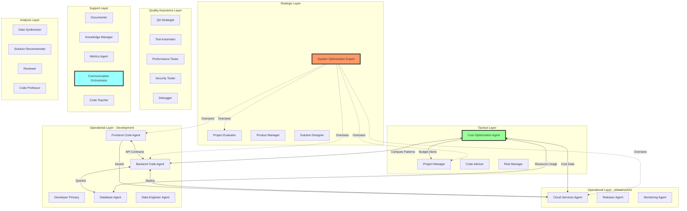
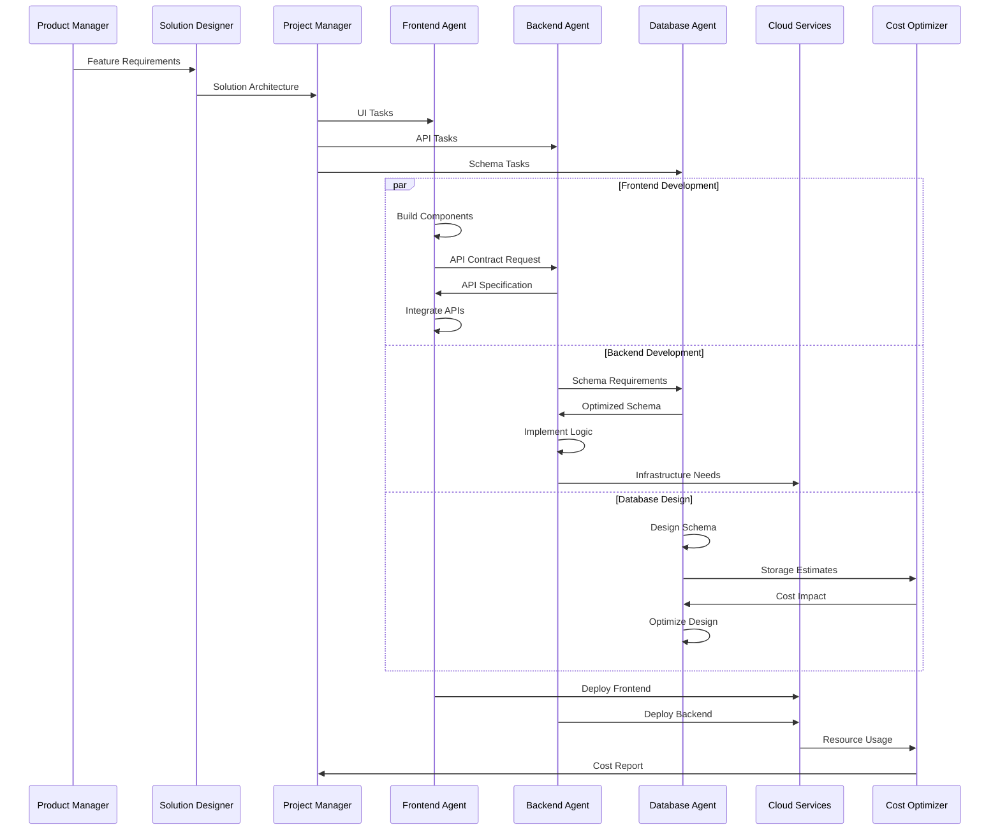
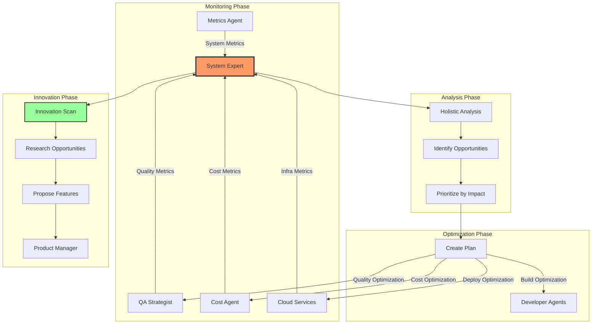
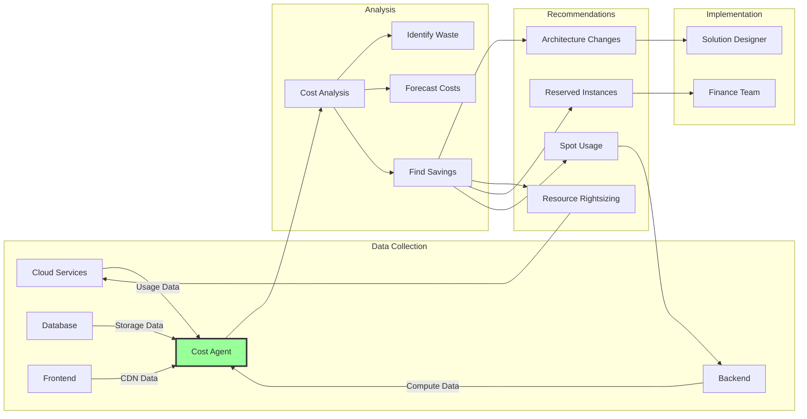
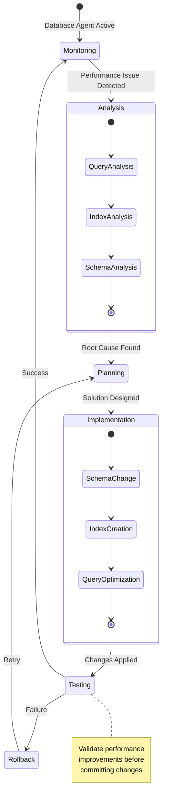
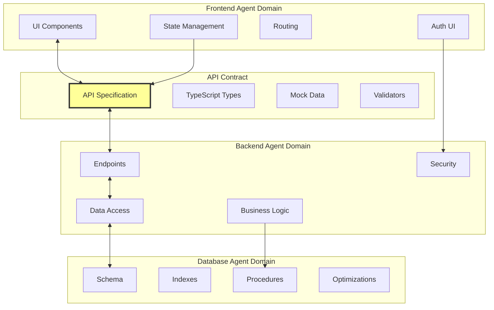
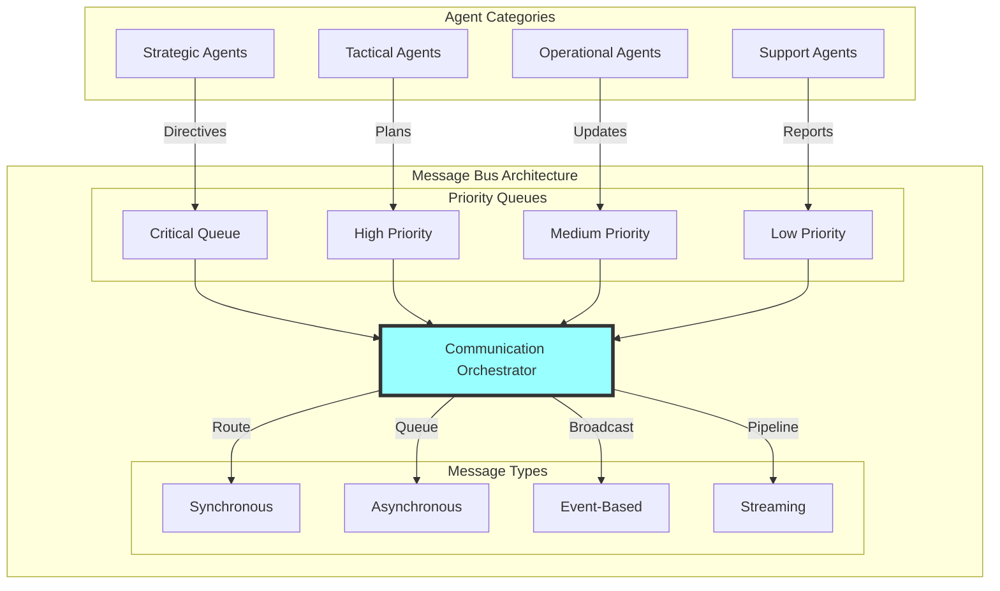
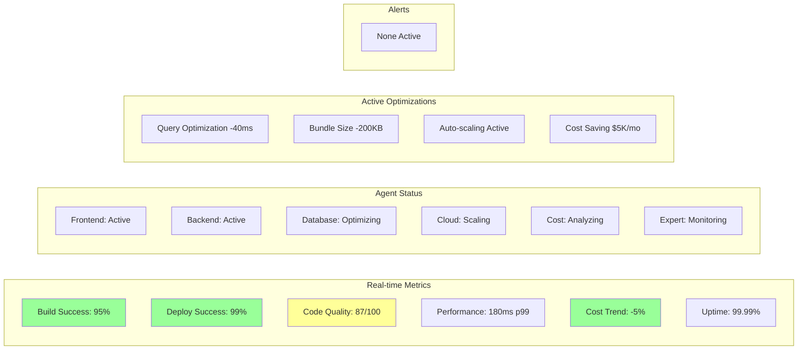
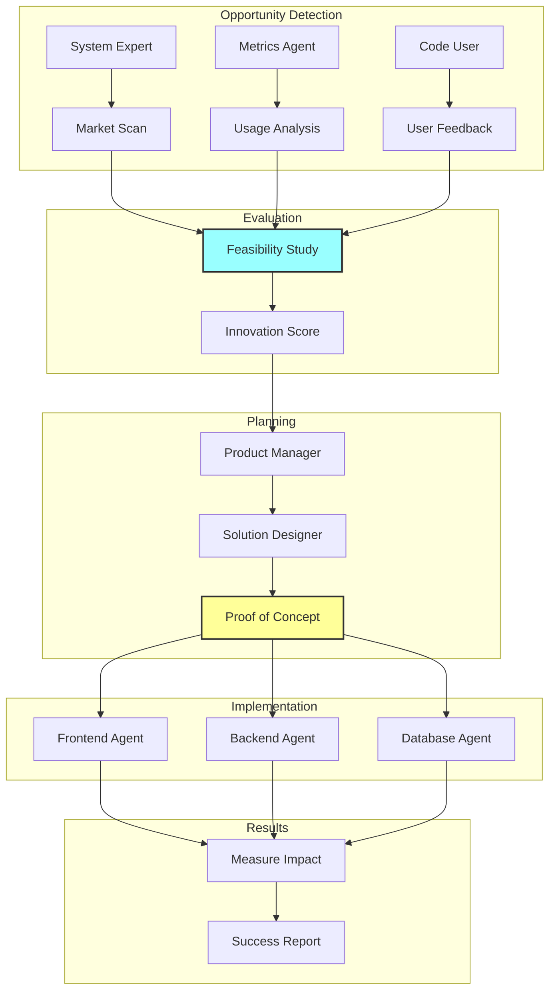
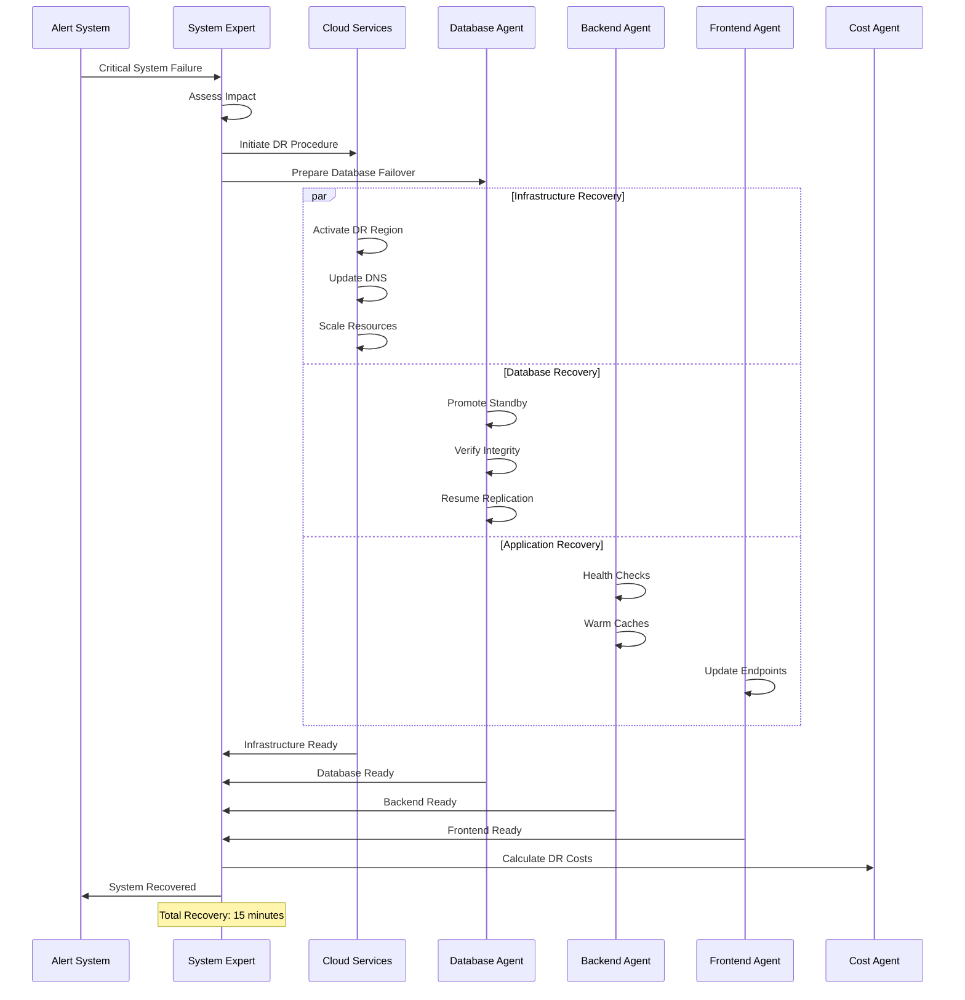

# Complete Agent Ecosystem Architecture

## System Overview

This document visualizes the complete multi-agent ecosystem with all specialized agents and their interactions.

## 1. Complete Agent Hierarchy

## 2. Code Development Flow

## 3. System Optimization Workflow

## 4. Cost Optimization Flow

## 5. Database Optimization Cycle

## 6. Frontend-Backend Integration

## 7. Complete Communication Matrix

## 8. System Health Dashboard

## 9. Innovation Pipeline

## 10. Disaster Recovery Coordination

## Key Integration Points

### 1. **Frontend ↔ Backend**
- API contract negotiation
- Type sharing
- Error handling coordination
- Performance optimization

### 2. **Backend ↔ Database**
- Query optimization
- Connection pooling
- Transaction management
- Schema evolution

### 3. **All Agents ↔ Cloud Services**
- Resource provisioning
- Deployment coordination
- Scaling decisions
- Security implementation

### 4. **All Agents ↔ Cost Optimization**
- Usage reporting
- Cost impact analysis
- Optimization recommendations
- Budget compliance

### 5. **All Agents ↔ System Expert**
- Performance metrics
- Quality metrics
- Innovation opportunities
- System-wide optimizations

## Success Metrics Dashboard

| Metric | Target | Current | Trend |
|--------|--------|---------|-------|
| Build Success | 95% | 96.2% | ↑ |
| Deploy Success | 99% | 99.4% | → |
| Code Quality | 85/100 | 87/100 | ↑ |
| System Uptime | 99.99% | 99.995% | → |
| API Latency p99 | <200ms | 180ms | ↓ |
| Cloud Costs | -5% MoM | -7% MoM | ↓ |
| Test Coverage | 90% | 92% | ↑ |
| Security Score | A | A+ | ↑ |

## Continuous Improvement Cycle

1. **Monitor**: All agents report metrics continuously
2. **Analyze**: System Expert identifies patterns
3. **Plan**: Optimization opportunities prioritized
4. **Execute**: Relevant agents implement changes
5. **Measure**: Impact assessed and documented
6. **Learn**: Knowledge Manager captures insights
7. **Repeat**: Cycle continues with new baseline