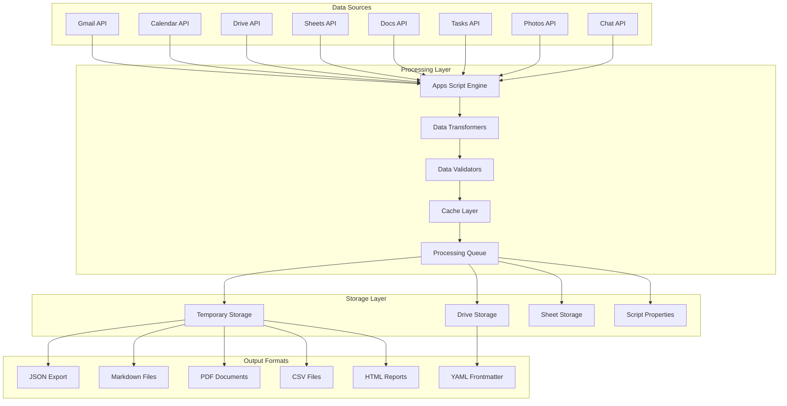
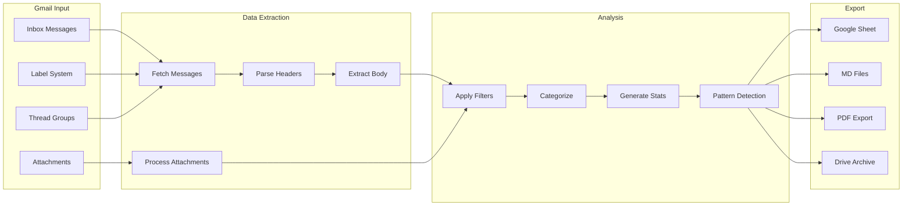
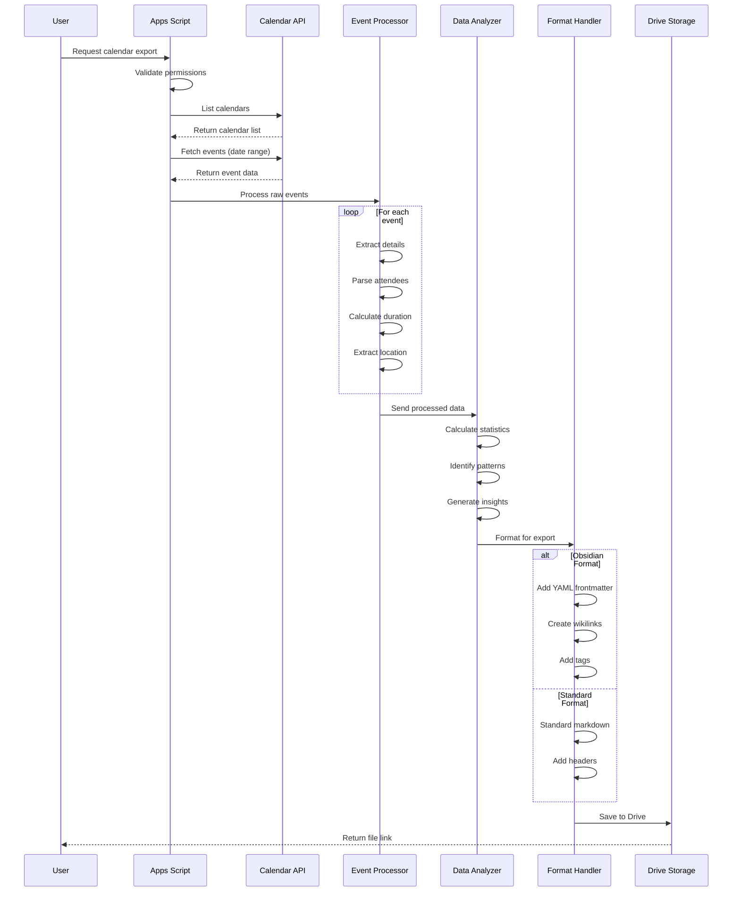
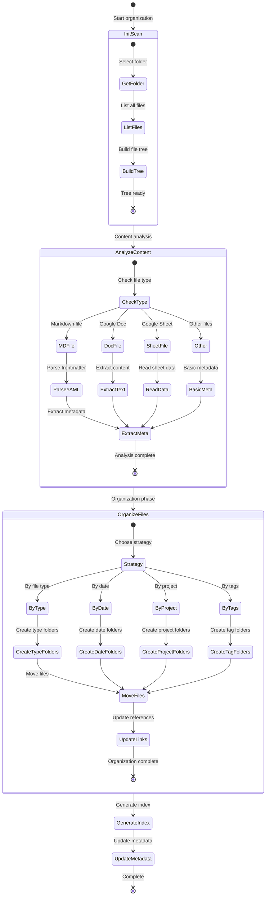
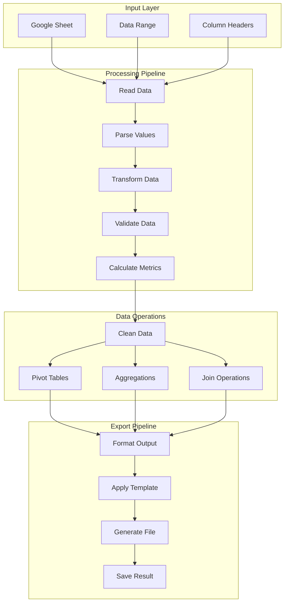
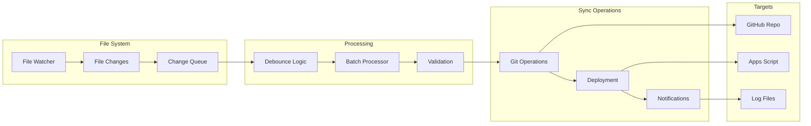
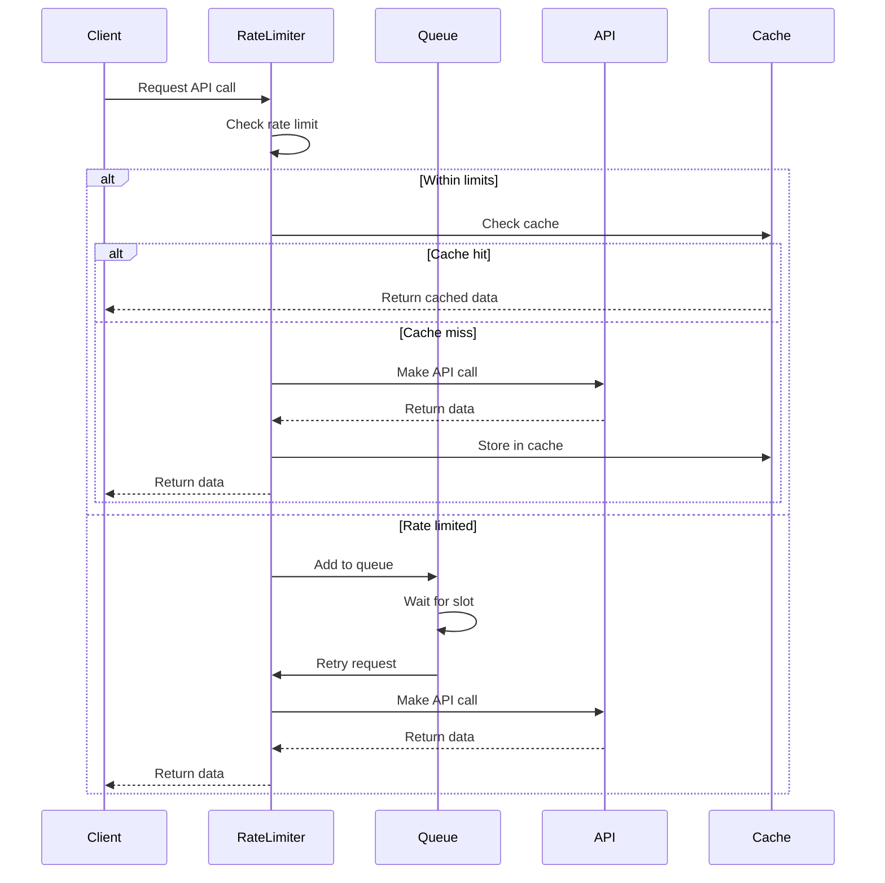
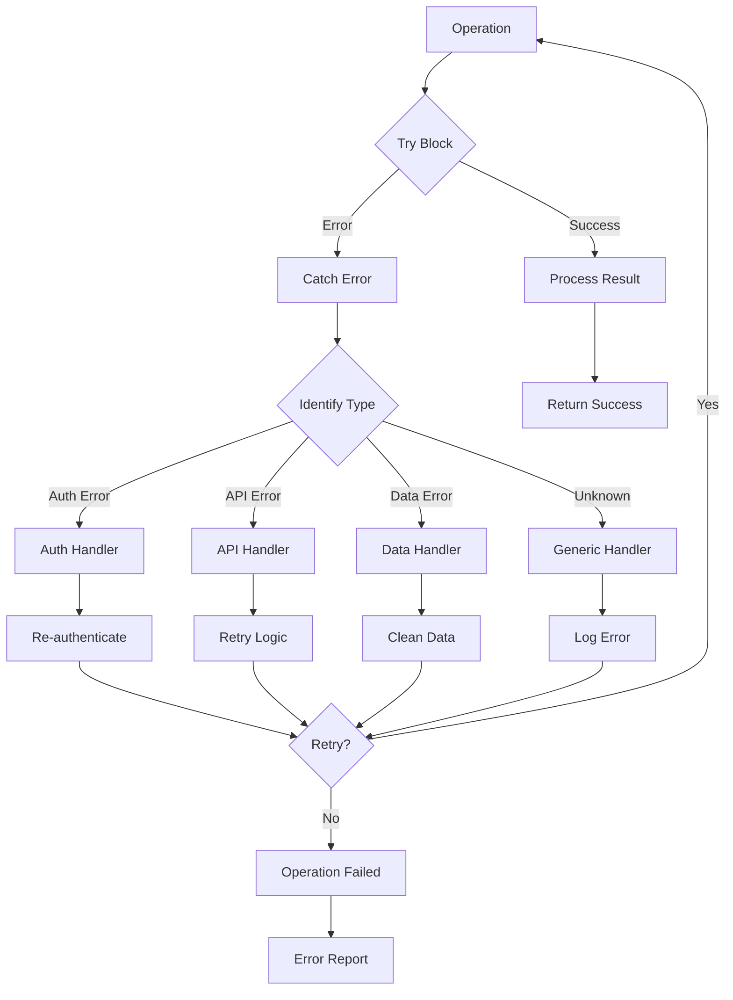

# Data Flow Diagrams

## Master Data Flow

## Email Processing Data Flow

## Calendar Event Data Flow

## Drive File Organization Flow

## Sheet Data Processing Flow

## Real-time Sync Data Flow

## API Rate Limiting Flow

## Error Handling Data Flow

