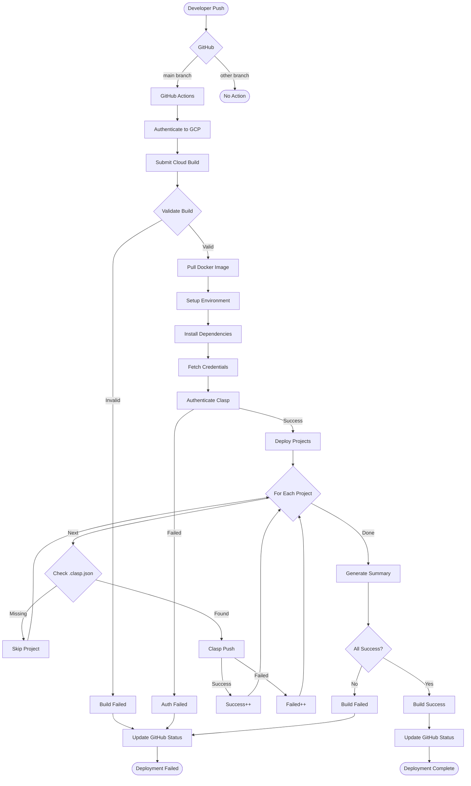
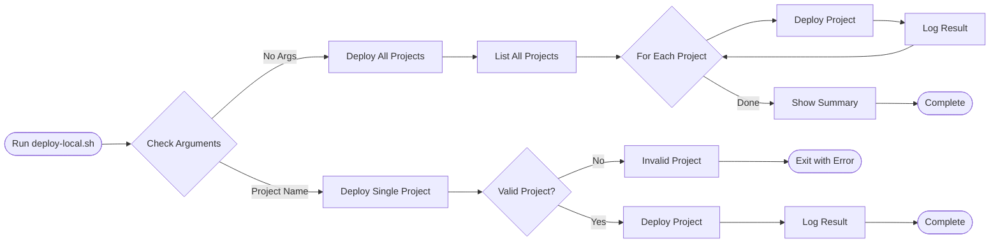
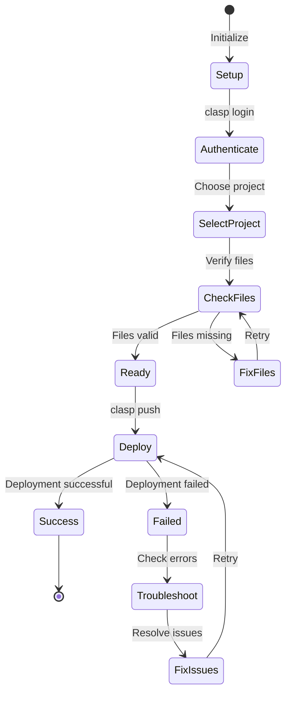
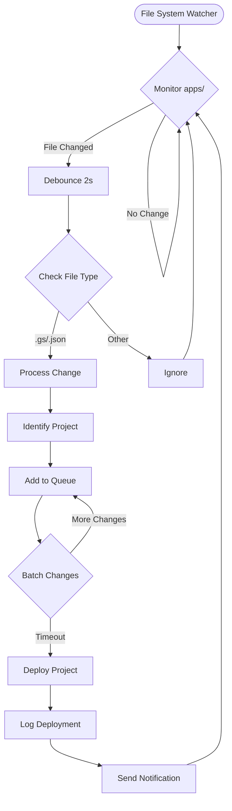
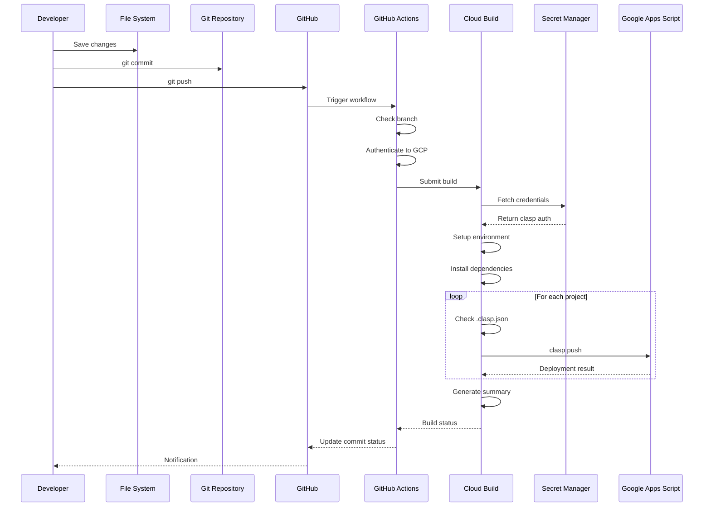
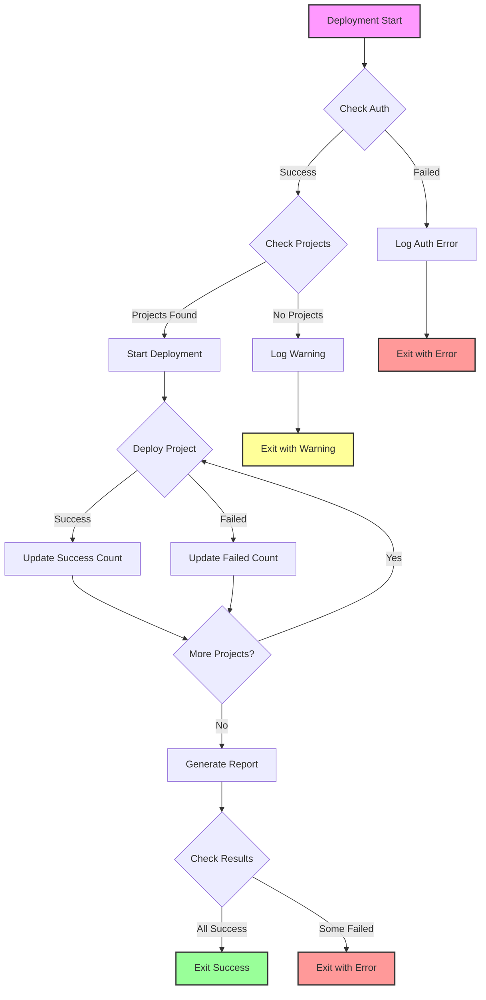

# Deployment Flow

## CI/CD Pipeline Flow

## Local Deployment Flow

## Manual Deployment Flow

## Auto-Sync Deployment Flow

## Deployment Sequence Diagram

## Error Handling Flow

## Deployment Status Indicators

| Symbol | Meaning |
|--------|---------|
| 🚀 | Deployment starting |
| ✅ | Deployment successful |
| ❌ | Deployment failed |
| ⚠️ | Warning/Skipped |
| 📦 | Processing project |
| 🔐 | Authentication check |
| 📊 | Summary report |
| 🔧 | Setup/Configuration |
| 📥 | Installing dependencies |
| 🎉 | All deployments successful |