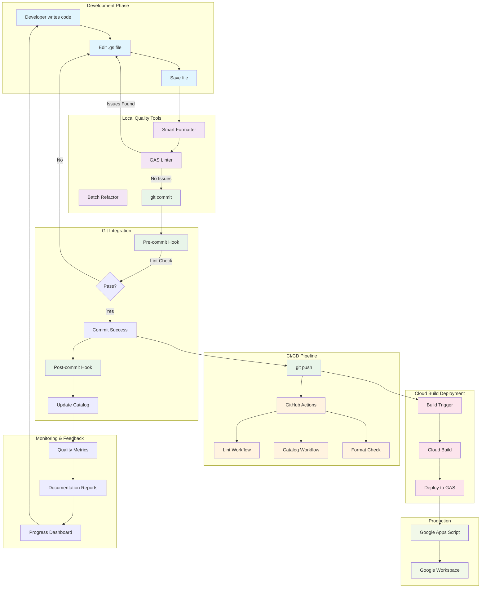
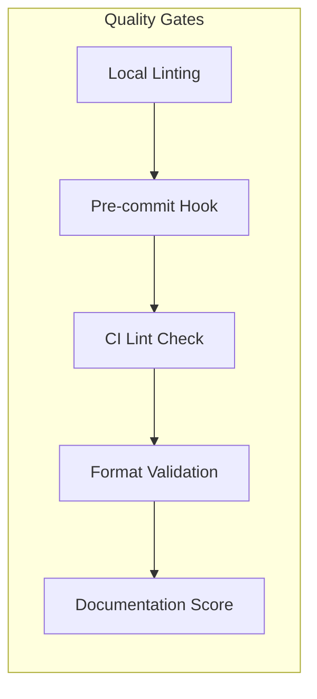

# Development Workflow Diagram

## Google Apps Script Development Lifecycle

This diagram illustrates the complete development workflow from code creation to production deployment, including all quality gates and automation tools.



## Workflow Stages

### 1. Development Phase
- Developer writes or modifies Google Apps Script code
- Uses IDE (VS Code or similar) with syntax highlighting
- Saves changes locally

### 2. Local Quality Tools
- **Smart Formatter**: Automatically adds headers and documentation
- **GAS Linter**: Validates against style guide
- **Batch Refactor**: Process multiple files systematically

### 3. Git Integration
- **Pre-commit Hook**: Runs linting on staged files
- **Post-commit Hook**: Updates script catalog
- Blocks commits with errors, allows with warnings

### 4. CI/CD Pipeline
- GitHub Actions workflows trigger on push
- Parallel execution of quality checks
- Comments on PRs with results

### 5. Cloud Build Deployment
- Triggered by pushes to main branch
- Uses custom Docker image with clasp
- Deploys to all configured GAS projects

### 6. Production
- Scripts run in Google Apps Script environment
- Integrate with Google Workspace services
- Execute on triggers or user actions

### 7. Monitoring & Feedback
- Script catalog tracks documentation coverage
- Quality metrics identify improvement areas
- Dashboard provides progress visibility

## Quality Gates



## Tool Commands Reference

### Local Development
```bash
# Format single file
npm run format:smart path/to/script.gs

# Lint and fix issues
npm run lint:fix

# Update catalog
npm run catalog
```

### Batch Operations
```bash
# Interactive refactor
npm run refactor:batch

# Process all scripts
npm run gas:fix
```

### Git Operations
```bash
# Setup hooks
npm run setup:git-hooks

# Quick sync
npm run git:sync
```

## Best Practices

1. **Before Committing**
   - Run `npm run gas:check` to validate
   - Fix any ERROR-level issues
   - Update documentation if needed

2. **Code Review**
   - Check lint results in PR comments
   - Verify documentation completeness
   - Ensure setup instructions are accurate

3. **Regular Maintenance**
   - Run catalog weekly
   - Review low-scoring scripts
   - Update setup instructions as needed

## Automation Benefits

- **Consistency**: All scripts follow same standards
- **Quality**: Automated checks prevent issues
- **Documentation**: Always up-to-date
- **Efficiency**: Batch processing saves time
- **Visibility**: Catalogs track progress
- **Collaboration**: Clear standards for team