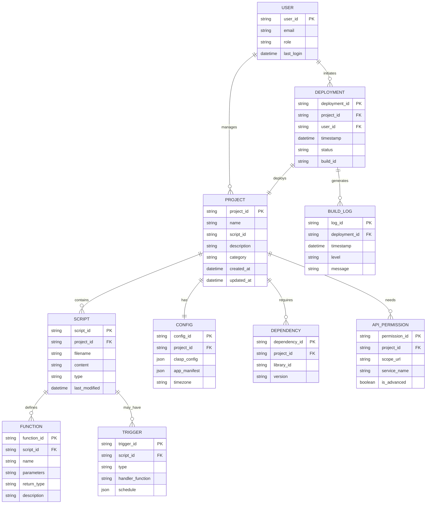
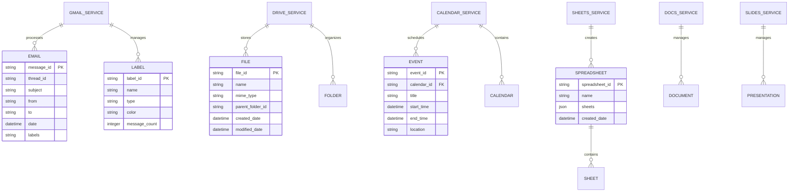

# Entity Relationship Diagram

## Google Apps Script Projects ERD

```mermaid
erDiagram
    PROJECT ||--o{ SCRIPT : contains
    PROJECT ||--|| CONFIG : has
    PROJECT ||--o{ DEPENDENCY : requires
    PROJECT ||--o{ API_PERMISSION : needs
    
    SCRIPT ||--o{ FUNCTION : defines
    SCRIPT ||--o{ TRIGGER : may_have
    
    DEPLOYMENT ||--|| PROJECT : deploys
    DEPLOYMENT ||--o{ BUILD_LOG : generates
    
    USER ||--o{ DEPLOYMENT : initiates
    USER ||--o{ PROJECT : manages
    
    PROJECT {
        string project_id PK
        string name
        string script_id
        string description
        string category
        datetime created_at
        datetime updated_at
    }
    
    SCRIPT {
        string script_id PK
        string project_id FK
        string filename
        string content
        string type
        datetime last_modified
    }
    
    CONFIG {
        string config_id PK
        string project_id FK
        json clasp_config
        json app_manifest
        string timezone
    }
    
    FUNCTION {
        string function_id PK
        string script_id FK
        string name
        string parameters
        string return_type
        string description
    }
    
    TRIGGER {
        string trigger_id PK
        string script_id FK
        string type
        string handler_function
        json schedule
    }
    
    API_PERMISSION {
        string permission_id PK
        string project_id FK
        string scope_url
        string service_name
        boolean is_advanced
    }
    
    DEPENDENCY {
        string dependency_id PK
        string project_id FK
        string library_id
        string version
    }
    
    DEPLOYMENT {
        string deployment_id PK
        string project_id FK
        string user_id FK
        datetime timestamp
        string status
        string build_id
    }
    
    BUILD_LOG {
        string log_id PK
        string deployment_id FK
        datetime timestamp
        string level
        string message
    }
    
    USER {
        string user_id PK
        string email
        string role
        datetime last_login
    }
```

## Google Workspace Services ERD

```mermaid
erDiagram
    GMAIL_SERVICE ||--o{ EMAIL : processes
    GMAIL_SERVICE ||--o{ LABEL : manages
    
    DRIVE_SERVICE ||--o{ FILE : stores
    DRIVE_SERVICE ||--o{ FOLDER : organizes
    
    CALENDAR_SERVICE ||--o{ EVENT : schedules
    CALENDAR_SERVICE ||--o{ CALENDAR : contains
    
    SHEETS_SERVICE ||--o{ SPREADSHEET : creates
    SPREADSHEET ||--o{ SHEET : contains
    
    DOCS_SERVICE ||--o{ DOCUMENT : manages
    SLIDES_SERVICE ||--o{ PRESENTATION : manages
    
    EMAIL {
        string message_id PK
        string thread_id
        string subject
        string from
        string to
        datetime date
        string labels
    }
    
    LABEL {
        string label_id PK
        string name
        string type
        string color
        integer message_count
    }
    
    FILE {
        string file_id PK
        string name
        string mime_type
        string parent_folder_id
        datetime created_date
        datetime modified_date
    }
    
    EVENT {
        string event_id PK
        string calendar_id FK
        string title
        datetime start_time
        datetime end_time
        string location
    }
    
    SPREADSHEET {
        string spreadsheet_id PK
        string name
        json sheets
        datetime created_date
    }
```