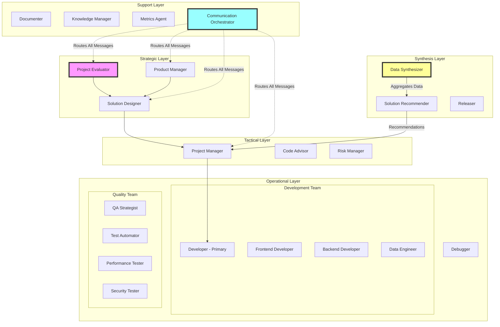
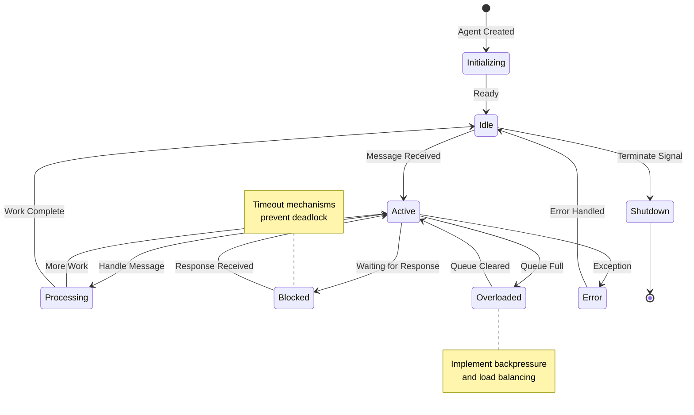
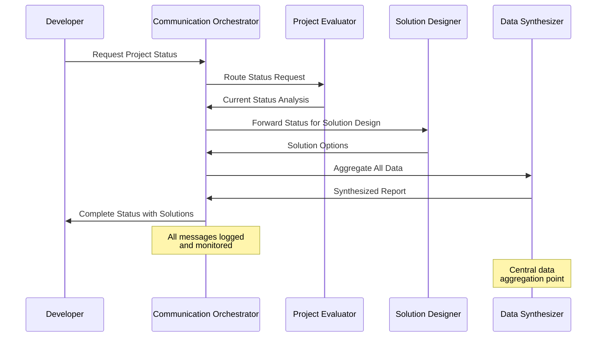
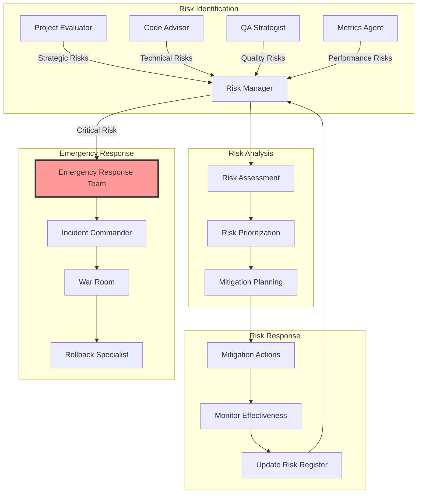
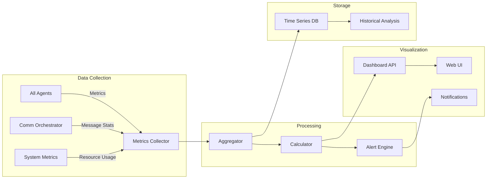
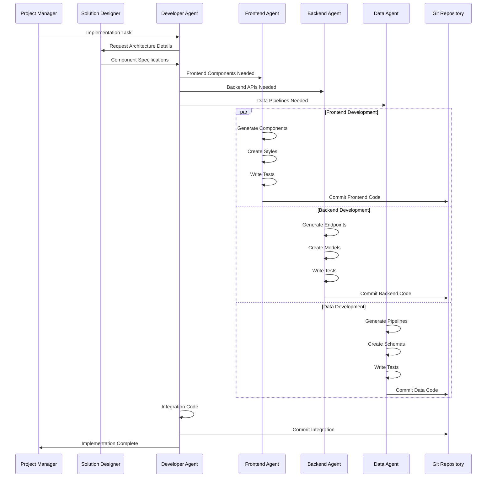
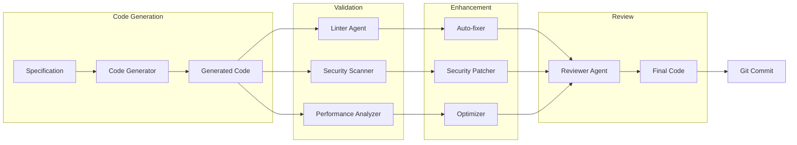
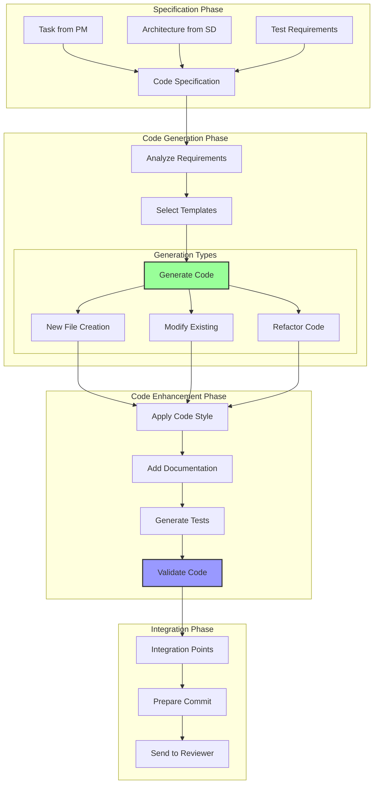

# Multi-Agent Development Framework

## Framework Overview

This document defines a comprehensive multi-agent system for software development, explicitly detailing how to create and implement each agent to deliver a fully functional autonomous development team.

## Agent Creation Requirements

### Core Implementation Guidelines

1. **Each agent must be created as a separate, executable module**
2. **Agents communicate via standardized message protocol**
3. **All agents must implement the base Agent interface**
4. **Agents are stateless and can be scaled horizontally**
5. **Each agent has explicit input/output contracts**

### Base Agent Interface

```typescript
interface BaseAgent {
  id: string;
  role: string;
  state: 'active' | 'idle' | 'blocked' | 'overloaded';
  
  // Core methods every agent must implement
  initialize(): Promise<void>;
  processMessage(message: AgentMessage): Promise<AgentResponse>;
  getCapabilities(): AgentCapabilities;
  getStatus(): AgentStatus;
  shutdown(): Promise<void>;
}

interface AgentMessage {
  from: string;
  to: string;
  type: MessageType;
  payload: any;
  priority: Priority;
  timestamp: Date;
  conversationId: string;
}
```

## Agent Creation Checklist

For each agent creation:
- [ ] Define explicit role and responsibilities
- [ ] Implement BaseAgent interface
- [ ] Create message handlers for all input types
- [ ] Define output message formats
- [ ] Implement state management
- [ ] Add performance monitoring
- [ ] Create unit tests
- [ ] Document API and usage
- [ ] Register with Communication Orchestrator

## System Architecture Diagrams

### 1. Agent Hierarchy and Communication Flow



### 2. Agent Lifecycle and State Management



### 3. Message Flow and Communication Protocol



### 4. Agent Creation and Deployment Pipeline

```mermaid
graph LR
    subgraph "Agent Development"
        REQ[Requirements] --> DESIGN[Agent Design]
        DESIGN --> IMPL[Implementation]
        IMPL --> TEST[Testing]
    end
    
    subgraph "Agent Deployment"
        TEST --> BUILD[Build Container]
        BUILD --> REG[Register with CO]
        REG --> DEPLOY[Deploy to Cluster]
        DEPLOY --> MONITOR[Monitor Performance]
    end
    
    subgraph "Agent Integration"
        MONITOR --> INTEGRATE[Integration Tests]
        INTEGRATE --> VALIDATE[Validate Communications]
        VALIDATE --> ACTIVE[Active in System]
    end
    
    style REQ fill:#fdd,stroke:#333,stroke-width:2px
    style ACTIVE fill:#dfd,stroke:#333,stroke-width:2px
```



### 5. Knowledge Management and Learning System

```mermaid
graph TB
    subgraph "Knowledge Capture"
        AGENTS[All Agents] -->|Log Decisions| KM[Knowledge Manager]
        AGENTS -->|Report Patterns| ML[Machine Learning Pipeline]
    end
    
    subgraph "Knowledge Storage"
        KM --> KB[Knowledge Base]
        KM --> DL[Decision Logs]
        KM --> LL[Lessons Learned]
        ML --> PM[Pattern Models]
    end
    
    subgraph "Knowledge Distribution"
        KB --> API[Knowledge API]
        API --> AGENTS
        PM --> REC[Recommendation Engine]
        REC --> AGENTS
    end
    
    Note over ML: Continuous learning<br/>from agent actions
```

### 6. Risk Management and Mitigation Flow



### 7. Performance Monitoring Dashboard Architecture



## Agent Implementation Specifications

### Strategic Layer Agents

#### 1. Project Evaluator
```yaml
creation_requirements:
  - Git history analysis capabilities
  - Temporal data processing
  - Goal definition framework
  - Success metrics calculator
  
implementation_steps:
  1. Create GitAnalyzer class for history parsing
  2. Implement TemporalAnalysis interface
  3. Build GoalFramework with SMART criteria
  4. Create MetricsEngine for KPI tracking
  
message_contracts:
  inputs:
    - StatusRequest
    - HistoricalAnalysisRequest
    - GoalValidationRequest
  outputs:
    - ProjectStatusReport
    - StrategicGoalsDocument
    - SuccessMetricsDefinition
```

#### 2. Solution Designer
```yaml
creation_requirements:
  - Architecture pattern library
  - Solution evaluation framework
  - Trade-off analysis engine
  - Constraint satisfaction solver
  
implementation_steps:
  1. Build PatternLibrary with common architectures
  2. Create SolutionEvaluator with scoring system
  3. Implement TradeOffAnalyzer
  4. Build ConstraintEngine
  
message_contracts:
  inputs:
    - GoalsDocument
    - ConstraintsList
    - ProblemStatement
  outputs:
    - SolutionArchitecture[]
    - TradeOffAnalysis
    - RecommendedApproach
```

### Tactical Layer Agents

#### 3. Project Manager
```yaml
creation_requirements:
  - Work breakdown structure generator
  - Resource allocation optimizer
  - Timeline estimation engine
  - Sprint planning toolkit
  
implementation_steps:
  1. Create WBSGenerator from solution specs
  2. Build ResourceOptimizer with constraints
  3. Implement EstimationEngine with ML
  4. Create SprintPlanner with velocity tracking
  
message_contracts:
  inputs:
    - SolutionArchitecture
    - TeamCapacity
    - Timeline constraints
  outputs:
    - ProjectPlan
    - SprintBacklog
    - ResourceAllocation
```

### Operational Layer Agents - Code Authors

#### 4. Developer (Primary Agent) - Core Code Author
```yaml
creation_requirements:
  - AST parser and generator for multiple languages
  - Code synthesis engine with templates
  - Integration with language servers (LSP)
  - Real-time code validation
  - Git integration for version control
  
implementation_steps:
  1. Implement CodeGenerator with language-specific modules
  2. Create ASTManipulator for code transformations
  3. Build CodeValidator with syntax/semantic checking
  4. Integrate LanguageServerProtocol for intelligence
  5. Create GitManager for commits and branches
  
code_authoring_capabilities:
  - Generate new files from specifications
  - Modify existing code preserving style
  - Refactor code maintaining functionality
  - Write unit tests for code coverage
  - Generate documentation from code
  
message_contracts:
  inputs:
    - ImplementationTask
    - CodeSpecification
    - RefactoringRequest
    - BugFixRequest
  outputs:
    - GeneratedCode
    - ModifiedFiles
    - TestSuite
    - CommitReady
```

#### 5. Frontend Developer Agent - UI Code Specialist
```yaml
creation_requirements:
  - React/Vue/Angular code generators
  - CSS preprocessor integration
  - Component library knowledge base
  - Responsive design engine
  - Accessibility compliance checker
  
implementation_steps:
  1. Build ComponentGenerator with framework templates
  2. Create StyleEngine for CSS/SCSS generation
  3. Implement ResponsiveDesigner with breakpoints
  4. Build A11yValidator for WCAG compliance
  5. Create StateManager for frontend state
  
code_authoring_capabilities:
  - Generate UI components from designs
  - Create responsive layouts
  - Implement user interactions
  - Write component tests
  - Generate Storybook stories
  - Optimize bundle size
  
message_contracts:
  inputs:
    - UIDesignSpec
    - ComponentRequest
    - InteractionFlow
    - AccessibilityRequirements
  outputs:
    - ComponentCode
    - StyleSheets
    - TestSpecs
    - StoryBookStories
```

#### 6. Backend Developer Agent - API Code Specialist
```yaml
creation_requirements:
  - REST/GraphQL endpoint generator
  - Database schema designer
  - ORM integration capabilities
  - Authentication/authorization modules
  - API documentation generator
  
implementation_steps:
  1. Create EndpointGenerator with routing
  2. Build SchemaDesigner for databases
  3. Implement ORMIntegrator for data access
  4. Create AuthModule for security
  5. Build APIDocGenerator (OpenAPI/Swagger)
  
code_authoring_capabilities:
  - Generate API endpoints from specs
  - Create database migrations
  - Implement business logic
  - Write integration tests
  - Generate API documentation
  - Implement security measures
  
message_contracts:
  inputs:
    - APISpecification
    - DataModel
    - BusinessRules
    - SecurityRequirements
  outputs:
    - APICode
    - DatabaseSchema
    - Migrations
    - APITests
    - Documentation
```

#### 7. Data Engineer Agent - Data Pipeline Code Author
```yaml
creation_requirements:
  - ETL pipeline generator
  - Stream processing capabilities
  - Data validation frameworks
  - Schema evolution handling
  - Performance optimization engine
  
implementation_steps:
  1. Build PipelineGenerator for ETL/ELT
  2. Create StreamProcessor for real-time
  3. Implement DataValidator with rules
  4. Build SchemaEvolver for migrations
  5. Create PerformanceOptimizer
  
code_authoring_capabilities:
  - Generate data pipelines
  - Create transformation logic
  - Implement data quality checks
  - Write performance benchmarks
  - Generate data documentation
  - Optimize query performance
  
message_contracts:
  inputs:
    - DataFlowSpec
    - TransformationRules
    - QualityRequirements
    - PerformanceTargets
  outputs:
    - PipelineCode
    - TransformationLogic
    - QualityChecks
    - BenchmarkSuite
```

### Code Generation Process Flow



### Code Quality Assurance Pipeline



### Code Authoring Workflow



### Support Layer Agents

#### 8. Communication Orchestrator
```yaml
creation_requirements:
  - Message queue implementation
  - Routing engine with rules
  - Priority queue manager
  - Dead letter handling
  
implementation_steps:
  1. Implement MessageQueue with RabbitMQ/Kafka
  2. Build RoutingEngine with configurable rules
  3. Create PriorityManager with preemption
  4. Implement DeadLetterHandler with retry
  
message_contracts:
  inputs:
    - Any AgentMessage
  outputs:
    - Routed AgentMessage
    - DeliveryConfirmation
    - ErrorNotification
```

#### 5. Knowledge Manager
```yaml
creation_requirements:
  - Document storage system
  - Search and retrieval engine
  - Knowledge graph builder
  - Pattern recognition system
  
implementation_steps:
  1. Setup ElasticSearch for document storage
  2. Build KnowledgeGraph with Neo4j
  3. Implement PatternRecognizer with ML
  4. Create QueryEngine with NLP
  
message_contracts:
  inputs:
    - KnowledgeEntry
    - QueryRequest
    - PatternReport
  outputs:
    - SearchResults
    - RelatedKnowledge
    - PatternInsights
```

## Deployment Strategy

### Phase 1: Core Infrastructure (Week 1-2)
1. Create Communication Orchestrator
2. Implement Base Agent Interface
3. Setup Message Queue System
4. Deploy Monitoring Infrastructure

### Phase 2: Strategic Agents (Week 3-4)
1. Deploy Project Evaluator
2. Deploy Solution Designer
3. Deploy Product Manager
4. Integrate with Communication Orchestrator

### Phase 3: Tactical Agents (Week 5-6)
1. Deploy Project Manager
2. Deploy Risk Manager
3. Deploy Code Advisor
4. Test strategic-tactical communication

### Phase 4: Operational Agents (Week 7-8)
1. Deploy specialized Developer agents
2. Deploy specialized QA agents
3. Deploy Debugger enhancements
4. Full integration testing

### Phase 5: Support Agents (Week 9-10)
1. Deploy Knowledge Manager
2. Deploy Metrics Agent
3. Deploy remaining support agents
4. Performance optimization

## Success Metrics

### Agent Performance Metrics
- Response time < 500ms for 95% of messages
- Message delivery success rate > 99.9%
- Agent availability > 99.5%
- Error rate < 0.1%

### System Performance Metrics
- End-to-end request completion < 5 seconds
- Concurrent agent operations > 100
- Knowledge retrieval time < 100ms
- System throughput > 1000 messages/second

## Testing Strategy

### Unit Testing
Each agent must have:
- 90% code coverage
- Mock message testing
- State transition testing
- Error handling validation

### Integration Testing
- Agent-to-agent communication
- Message routing validation
- System resilience testing
- Performance benchmarking

### System Testing
- Full workflow scenarios
- Chaos engineering tests
- Load testing at scale
- Disaster recovery validation

## Monitoring and Observability

### Required Monitoring
1. Agent health checks every 30 seconds
2. Message queue depth monitoring
3. Response time percentiles (p50, p95, p99)
4. Error rate tracking with alerting
5. Resource utilization per agent

### Dashboards
1. System Overview Dashboard
2. Agent Performance Dashboard
3. Message Flow Visualization
4. Knowledge Base Analytics
5. Risk Management Dashboard

## Additional Specialized Agents

For complete role definitions of specialized agents, see:
- [SPECIALIZED_AGENT_ROLES.md](./SPECIALIZED_AGENT_ROLES.md) - Detailed definitions for:
  - Frontend Code Agent
  - Backend Code Agent  
  - Database Agent
  - Cloud Services Agent
  - Cost Optimization Agent
  - System Optimization Expert Agent

For the complete ecosystem visualization, see:
- [COMPLETE_AGENT_ECOSYSTEM.md](./COMPLETE_AGENT_ECOSYSTEM.md) - Full system architecture with all agents

For implementation guidance, see:
- [AGENT_IMPLEMENTATION_GUIDE.md](./AGENT_IMPLEMENTATION_GUIDE.md) - Step-by-step implementation instructions

## Conclusion

This framework provides a complete blueprint for creating a multi-agent development system. Each agent has explicit creation requirements, implementation steps, and integration points. The phased deployment approach ensures systematic building and testing of the system while maintaining operational stability.

The key to success is treating each agent as a microservice with clear boundaries, standardized communication, and comprehensive monitoring. This approach enables horizontal scaling, fault tolerance, and continuous improvement of the system.

### Critical Success Factors

1. **Clear Role Definition**: Each agent must have a single, well-defined purpose
2. **Standardized Communication**: All agents use the same message protocol
3. **Autonomous Operation**: Agents make decisions within their domain
4. **Continuous Monitoring**: Every action is measured and reported
5. **Graceful Degradation**: System continues even if agents fail
6. **Knowledge Sharing**: Agents learn from each other's successes
7. **Human Oversight**: Critical decisions require human approval