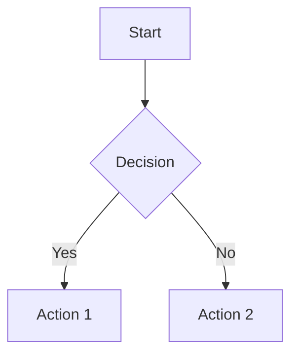
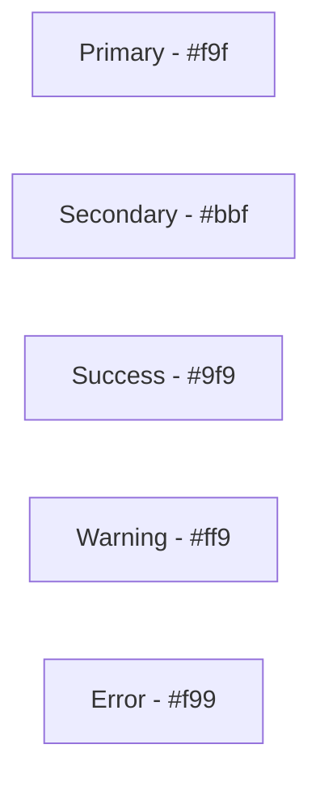

# Diagrams

Visual documentation and architecture diagrams for the Workspace Automation project.

## Overview

This directory contains visual representations of the system architecture, deployment flows, and repository structure using various diagram formats including Mermaid.js and ASCII art.

## Diagrams

| File Name | Purpose | Format |
|-----------|---------|--------|
| ARCHITECTURE.md | System architecture overview | Mermaid.js |
| DEPLOYMENT_FLOW.md | Deployment pipeline visualization | Mermaid.js |
| REPOSITORY_STRUCTURE.md | Directory structure and organization | Tree + Mermaid.js |

## Diagram Details

### ARCHITECTURE.md

Comprehensive system architecture including:
- Component relationships
- Service interactions
- Data flow between systems
- Technology stack visualization

### DEPLOYMENT_FLOW.md

Deployment pipeline visualization showing:
- File save to deployment flow
- Local vs Cloud Build paths
- Error handling procedures
- Status indicators

### REPOSITORY_STRUCTURE.md

Repository organization with:
- Directory tree structure
- Visual hierarchy diagram
- File naming conventions
- Growth areas for future expansion

## Mermaid.js Usage

### Rendering Diagrams

Mermaid.js diagrams can be rendered:
- **GitHub**: Automatically rendered in markdown files
- **VS Code**: Use Mermaid preview extensions
- **Online**: [Mermaid Live Editor](https://mermaid.live)
- **Documentation**: Most modern documentation tools support Mermaid

### Basic Mermaid Syntax



### Diagram Types Used

1. **Flowcharts** (`graph` or `flowchart`)
   - Deployment flows
   - Process workflows
   - Decision trees

2. **Sequence Diagrams** (`sequenceDiagram`)
   - API interactions
   - Deployment sequences
   - User workflows

3. **Component Diagrams** (`graph`)
   - System architecture
   - Service relationships
   - Directory structures

## Creating New Diagrams

### Guidelines

1. **Clarity First**: Prioritize readability over complexity
2. **Consistent Styling**: Use standard colors and shapes
3. **Descriptive Labels**: Clear, concise node labels
4. **Logical Flow**: Top-to-bottom or left-to-right

### Standard Colors



### Adding a New Diagram

1. Create new `.md` file with descriptive name
2. Include diagram purpose and overview
3. Add Mermaid code blocks
4. Document any special notations
5. Update this README

## ASCII Diagrams

For simple structures, ASCII art is used:

```
workspace-automation/
├── apps/
│   ├── calendar/
│   ├── gmail/
│   └── ...
└── automation/
```

**When to Use ASCII:**
- Directory structures
- Simple hierarchies
- Terminal-friendly documentation

## Maintenance

### Updating Diagrams

1. Verify diagram renders correctly
2. Test in multiple viewers (GitHub, VS Code)
3. Update related documentation
4. Include "Last Updated" date

### Diagram Standards

- Maximum width: 120 characters (for ASCII)
- Consistent node sizing in Mermaid
- Clear legends for symbols/colors
- Version information where relevant

## Tools and Resources

### Recommended Tools

- **VS Code Extensions**: Mermaid Preview, Markdown Preview Enhanced
- **Online Editors**: mermaid.live, draw.io
- **CLI Tools**: mmdc (Mermaid CLI)

### Learning Resources

- [Mermaid Documentation](https://mermaid-js.github.io/mermaid/)
- [GitHub Mermaid Support](https://github.blog/2022-02-14-include-diagrams-markdown-files-mermaid/)
- [ASCII Art Tools](https://asciiflow.com/)

---

Last Updated: July 2025