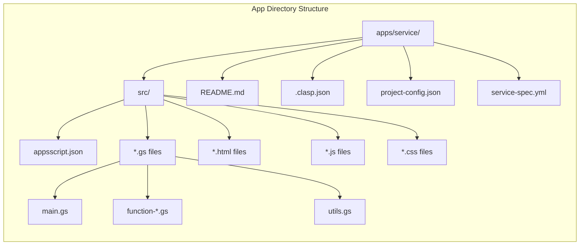
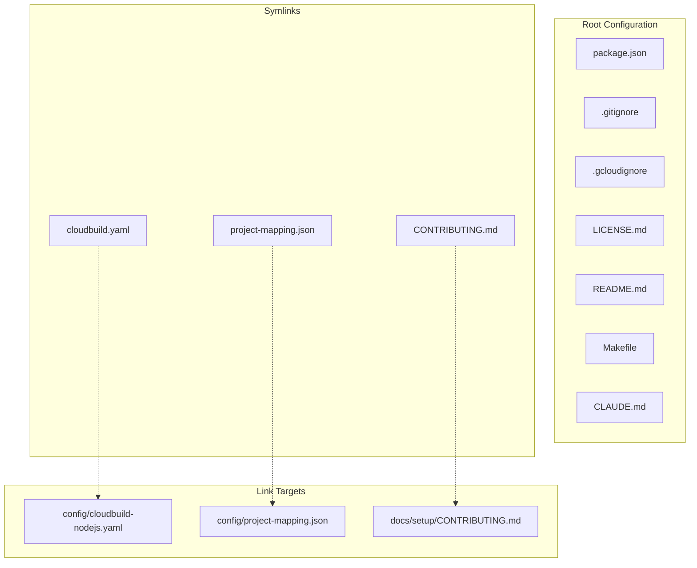
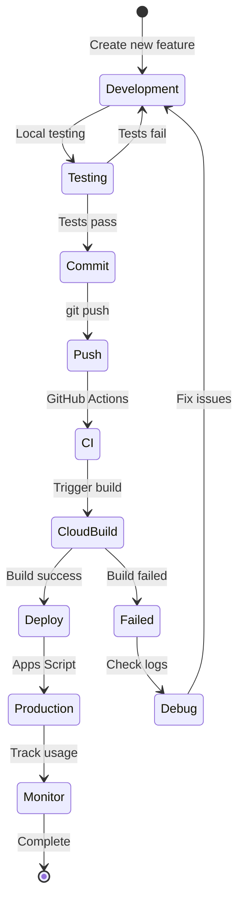
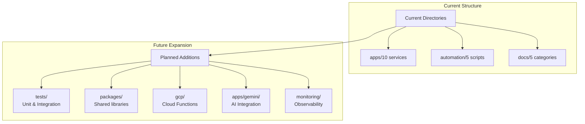
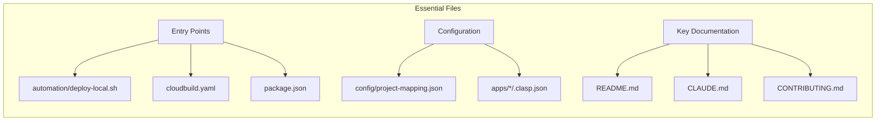

# Repository Structure Diagram

## Complete Repository Structure

```mermaid
graph TD
    ROOT[workspace-automation/]
    
    ROOT --> APPS[apps/]
    ROOT --> AUTOMATION[automation/]
    ROOT --> CONFIG[config/]
    ROOT --> DOCS[docs/]
    ROOT --> TOOLS[tools/]
    ROOT --> SECURITY[security/]
    ROOT --> DIAGRAMS[diagrams/]
    ROOT --> LOGS[logs/]
    ROOT --> REPORTS[reports/]
    ROOT --> GITHUB[.github/]
    ROOT --> BUILDER[builder/]
    ROOT --> ARCHIVE[archive/]
    ROOT --> TEMPLATES[templates/]
    ROOT --> STANDARDS[standards/]
    
    APPS --> CALENDAR[calendar/<br/>Calendar automation scripts]
    APPS --> CHAT[chat/<br/>Chat export scripts]
    APPS --> DOCS_APP[docs/<br/>Document processing]
    APPS --> DRIVE[drive/<br/>Drive organization tools]
    APPS --> GMAIL[gmail/<br/>Email automation]
    APPS --> PHOTOS[photos/<br/>Photo management]
    APPS --> SHEETS[sheets/<br/>Spreadsheet utilities]
    APPS --> SLIDES[slides/<br/>Presentation tools]
    APPS --> TASKS[tasks/<br/>Task management]
    APPS --> UTILITY[utility/<br/>Helper functions]
    
    AUTOMATION --> AUTOSYNC[auto-sync-full.sh]
    AUTOMATION --> DEPLOYLOCAL[deploy-local.sh]
    AUTOMATION --> TESTDEPLOY[test-deployment.sh]
    AUTOMATION --> SYNCCONTROL[sync-control.sh]
    AUTOMATION --> COMMITPUSH[auto-commit-push.sh]
    
    CONFIG --> CLOUDBUILD[cloudbuild.yaml]
    CONFIG --> CLOUDBUILDALT[cloudbuild-nodejs.yaml]
    CONFIG --> CLOUDBUILDDIAG[cloudbuild-diagnostic.yaml]
    CONFIG --> PROJECTMAP[project-mapping.json]
    CONFIG --> WATCHERCONF[com.workspace-automation.watcher.plist]
    
    DOCS --> ARCHITECTURE[architecture/]
    DOCS --> GUIDES[guides/]
    DOCS --> MILESTONES[milestones/]
    DOCS --> SETUP[setup/]
    DOCS --> REORGANIZATION[reorganization/]
    DOCS --> README_DOCS[README.md]
    
    DIAGRAMS --> ERD[ERD.md]
    DIAGRAMS --> SYSARCH[SYSTEM_ARCHITECTURE.md]
    DIAGRAMS --> DEPLOYFLOW[DEPLOYMENT_FLOW.md]
    DIAGRAMS --> USERFLOWS[USER_FLOWS.md]
    DIAGRAMS --> DATAFLOW[DATA_FLOW.md]
    DIAGRAMS --> DATAMODEL[DATA_MODEL.md]
    DIAGRAMS --> ARCHITECTURE_DIAG[ARCHITECTURE.md]
    DIAGRAMS --> REPOSTRUCTURE[REPOSITORY_STRUCTURE.md]
    
    GITHUB --> WORKFLOWS[workflows/]
    WORKFLOWS --> DEPLOY[deploy.yml]
    WORKFLOWS --> CODEQUALITY[code-quality.yml]
    
    BUILDER --> DOCKERFILE[Dockerfile]
    BUILDER --> SEQUENCE[SEQUENCE_FLOW.md]
    
    SECURITY --> SECURITYREVIEW[SECURITY_REVIEW.md]
    SECURITY --> SECURITYFIXES[SECURITY_FIXES_APPLIED.md]
    SECURITY --> SCANRESULTS[scan-results/]
    SECURITY --> SNYK[Snyk/]
    
    style ROOT fill:#f9f,stroke:#333,stroke-width:4px
    style APPS fill:#bbf,stroke:#333,stroke-width:2px
    style AUTOMATION fill:#bfb,stroke:#333,stroke-width:2px
    style CONFIG fill:#fbf,stroke:#333,stroke-width:2px
    style DOCS fill:#ffb,stroke:#333,stroke-width:2px
    style DIAGRAMS fill:#fbb,stroke:#333,stroke-width:2px
    style GITHUB fill:#bff,stroke:#333,stroke-width:2px
    style SECURITY fill:#faa,stroke:#333,stroke-width:2px
```



## Apps Directory Structure



## Configuration Hierarchy



## File Organization Pattern

```mermaid
flowchart TD
    subgraph "File Types"
        GS[Google Script Files .gs]
        JSON[Configuration .json]
        MD[Documentation .md]
        SH[Shell Scripts .sh]
        YAML[Config Files .yaml]
        HTML[Templates .html]
        JS[JavaScript .js]
    end
    
    subgraph "Organization Rules"
        RULE1[Apps go in apps/{service}/src/]
        RULE2[Scripts go in automation/]
        RULE3[Configs go in config/]
        RULE4[Docs go in docs/{category}/]
        RULE5[Diagrams go in diagrams/]
        RULE6[Tools go in tools/]
        RULE7[Security scans go in security/]
    end
    
    GS --> RULE1
    SH --> RULE2
    YAML --> RULE3
    JSON --> RULE3
    MD --> RULE4
    MD --> RULE5
    JS --> RULE6
    
    RULE1 --> APPDIR[apps/{service}/src/]
    RULE2 --> AUTODIR[automation/]
    RULE3 --> CONFDIR[config/]
    RULE4 --> DOCDIR[docs/{category}/]
    RULE5 --> DIAGDIR[diagrams/]
    RULE6 --> TOOLDIR[tools/]
    RULE7 --> SECDIR[security/scan-results/]
```

## Project Lifecycle Flow



## Directory Growth Plan



## File Naming Conventions

| Type | Pattern | Example |
|------|---------|---------|
| Scripts | `service-function-description.gs` | `gmail-filter-manager.gs` |
| Config | `lowercase-with-dashes.yaml` | `cloudbuild-diagnostic.yaml` |
| Docs | `UPPERCASE_TOPIC.md` | `ARCHITECTURE.md` |
| Tests | `test-*.js` | `test-gmail-export.js` |
| Utils | `utils-*.gs` | `utils-date-format.gs` |

## Key Files Reference

