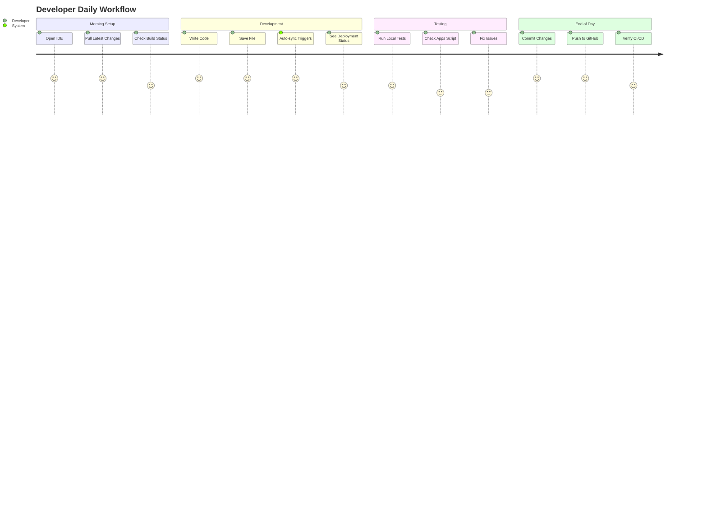
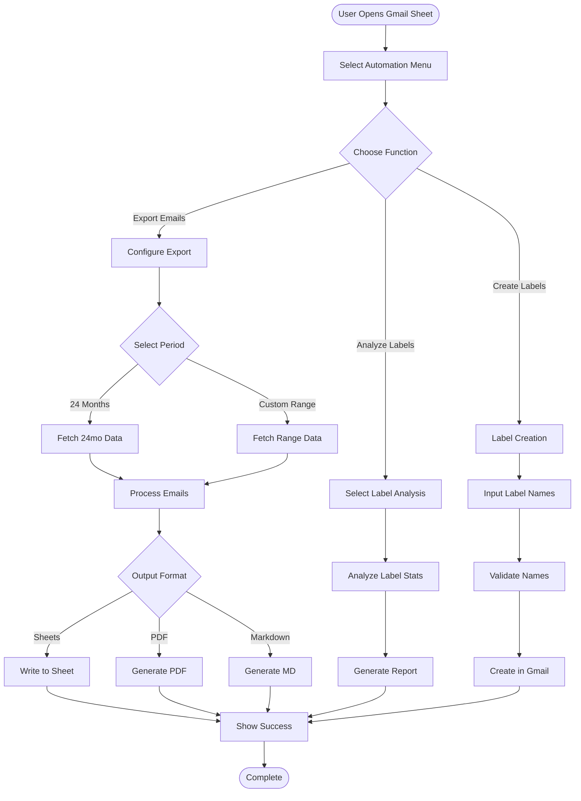
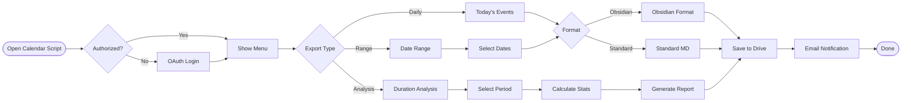
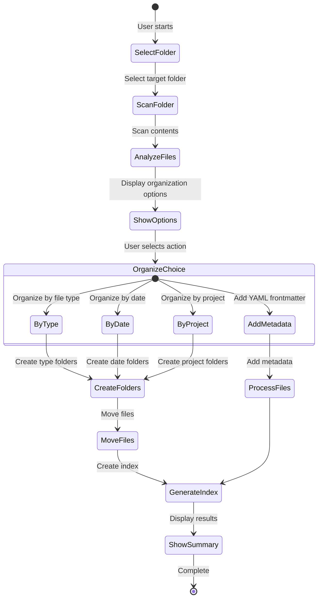
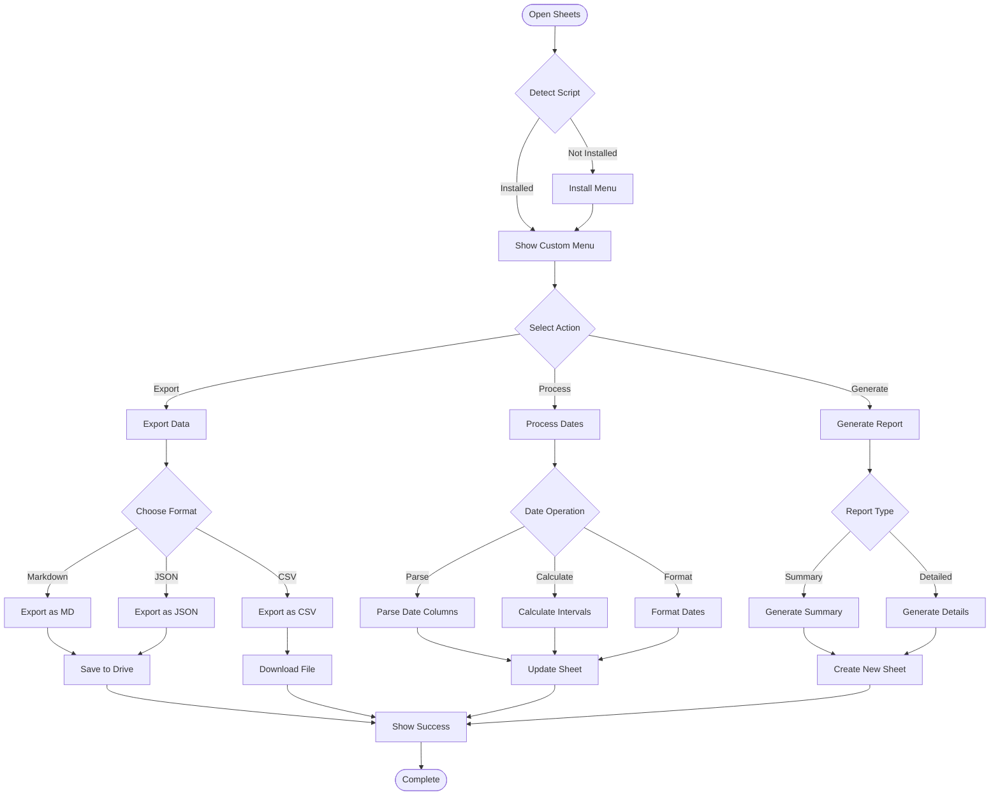
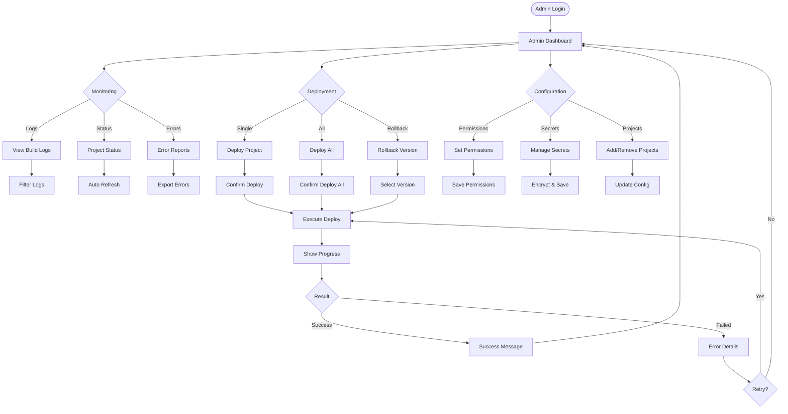
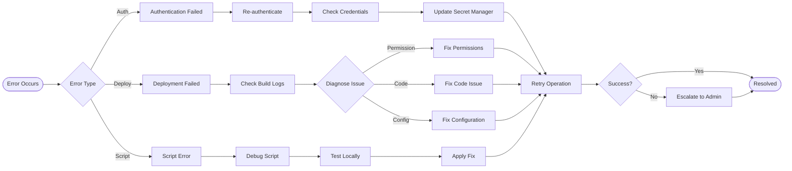

# User Flow Diagrams

## Developer Workflow

## Gmail Automation User Flow

## Calendar Export User Flow

## Drive Organization User Flow

## Sheets Automation User Flow

## Admin Dashboard Flow

## Error Recovery Flow

