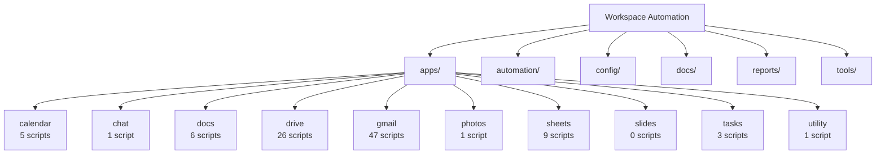
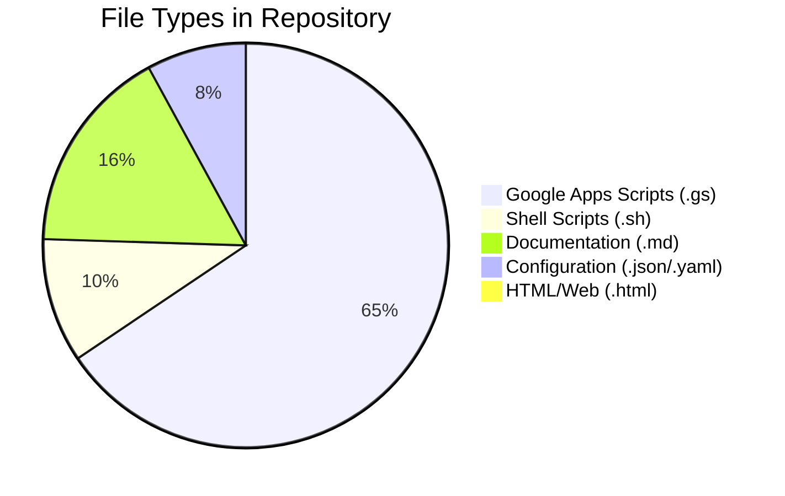

# Repository Cleanup & Reorganization Plan

## Current Issues
1. **Over-nested folders**: projects/gmail has 10+ subdirectories
2. **Duplicate .clasp.json files**: In root (calendar/, gmail/, drive/) AND projects/
3. **Hidden directories**: .docs, .reports, .projects should be visible
4. **Inconsistent naming**: Mix of kebab-case, spaces, and different patterns
5. **Clutter in root**: Too many individual files, scripts, and logs

## Proposed New Structure

```
Workspace-Automation/
├── README.md                    # Main documentation
├── LICENSE.md                   # License file
├── .gitignore                   # Git ignore rules
├── package.json                 # Node dependencies
│
├── apps/                        # All Google Apps Script projects (renamed from projects/)
│   ├── calendar/               
│   ├── chat/                   
│   ├── docs/                   
│   ├── drive/                  
│   ├── gmail/                  # FLATTEN: Remove all subdirectories
│   ├── photos/                 
│   ├── sheets/                 
│   ├── slides/                 
│   ├── tasks/                  
│   └── utility/                
│
├── automation/                  # All automation scripts
│   ├── deploy-local.sh         
│   ├── sync-control.sh         
│   ├── auto-sync-full.sh       
│   └── test-deployment.sh      
│
├── config/                      # Configuration files
│   ├── project-mapping.json    
│   ├── cloudbuild.yaml         
│   └── cloudbuild-diagnostic.yaml
│
├── docs/                        # Documentation (unhidden)
│   ├── architecture/           
│   ├── milestones/             
│   └── guides/                 
│
├── reports/                     # Reports (unhidden)
│   └── [daily/weekly reports]  
│
├── tools/                       # Development tools
│   └── [existing tools]        
│
└── archive/                     # Old/backup files
    ├── scripts-backup-20250723/
    └── legacy-configs/         
```

## Impact on Working Code

### 1. **Automation Scripts** - HIGH IMPACT
- `deploy-local.sh`: Update paths from `projects/` to `apps/`
- `auto-sync-full.sh`: Update WATCH_DIR path
- `test-deployment.sh`: Update project paths
- All scripts referencing `projects/` directory

### 2. **Cloud Build** - HIGH IMPACT
- `cloudbuild.yaml`: Update all project paths
- `cloudbuild-diagnostic.yaml`: Update all project paths
- GitHub Actions workflows: Update paths

### 3. **Git Configuration** - MEDIUM IMPACT
- `.gitignore`: Update paths
- Pre-commit hooks: Update validation paths

### 4. **Gmail Subdirectory Cleanup** - HIGH IMPACT
- Move all .gs files from subdirectories to `apps/gmail/src/`
- Remove complex nested structure
- Update any internal references

## Migration Steps

### Phase 1: Backup Current State
1. Create full backup of current structure
2. Document all working paths
3. Test current automation one more time

### Phase 2: Restructure Directories
1. Rename `projects/` to `apps/`
2. Unhide directories (remove leading dots)
3. Create new organizational folders
4. Flatten Gmail structure

### Phase 3: Update All References
1. Update all shell scripts
2. Update Cloud Build configurations
3. Update GitHub Actions
4. Update documentation

### Phase 4: Test Everything
1. Test local deployment
2. Test auto-sync
3. Test Cloud Build
4. Verify all scripts still work

## File Naming Conventions

### Scripts (.gs files)
- Pattern: `{service}-{action}-{target}.gs`
- Examples:
  - `gmail-export-pdf.gs`
  - `calendar-analysis-duration.gs`
  - `drive-index-files.gs`

### Configuration Files
- Use lowercase with hyphens
- Clear, descriptive names
- Include file type in name if helpful

### Documentation
- UPPERCASE for key docs (README.md, LICENSE.md)
- Title case for guides
- Include dates where relevant

## Risks & Mitigation

| Risk | Impact | Mitigation |
|------|--------|------------|
| Breaking automation | HIGH | Test each change incrementally |
| Lost file references | MEDIUM | Document all path changes |
| Git history confusion | LOW | Clear commit messages |
| Deployment failures | HIGH | Keep backup of working config |

## Success Criteria
- ✅ Root directory has <10 files
- ✅ No directories start with dots (except .git, .gitignore)
- ✅ Gmail has flat structure in apps/gmail/src/
- ✅ All automation still works
- ✅ Consistent file naming throughout
- ✅ Clear, logical organization
- ✅ Complete vault structure diagrams in diagrams/ folder

## Documentation Requirements

### Vault Structure Diagrams
Create comprehensive diagrams in the `diagrams/` folder:

1. **VAULT_STRUCTURE.md** - High-level folder structure
   - Tree diagram showing all folders
   - Mermaid.js diagram showing folder relationships

2. **VAULT_FILES.md** - Deep dive into files
   - Detailed file listings for each folder
   - Mermaid.js diagram showing file types and counts

### Diagram Templates

#### Tree Structure Example:
```
Workspace-Automation/
├── apps/
│   ├── calendar/ (5 scripts)
│   ├── chat/ (1 script)
│   ├── docs/ (6 scripts)
│   ├── drive/ (26 scripts)
│   ├── gmail/ (47 scripts)
│   ├── photos/ (1 script)
│   ├── sheets/ (9 scripts)
│   ├── slides/ (0 scripts)
│   ├── tasks/ (3 scripts)
│   └── utility/ (1 script)
├── automation/ (6 scripts)
├── config/ (3 files)
├── docs/ (10+ documents)
├── reports/ (ongoing)
└── tools/ (15+ utilities)
```

#### Mermaid.js Folder Structure:


#### Mermaid.js File Type Distribution:


---

**Ready to proceed?** This plan will take approximately 2-3 hours to implement safely.