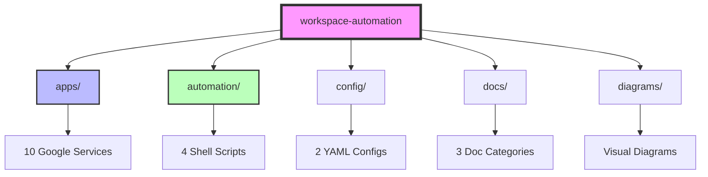

# Vault Structure Documentation

## Overview
This repository follows a clean, scalable structure optimized for Google Apps Script development with CI/CD automation.

## Core Principles
1. **Clean Root** - Minimal files at root level
2. **Flat Structure** - Avoid deep nesting
3. **Consistent Naming** - Predictable file and folder names
4. **Future-Ready** - Structure supports growth

## Directory Structure

```
.
├── apps/                 # All Google Apps Script projects
├── automation/          # Deployment and sync scripts  
├── config/             # Configuration files
├── docs/               # Documentation
├── diagrams/           # Visual documentation
└── .github/            # GitHub-specific files
```

## Quick Navigation

### For Script Development
- **Scripts Location**: `apps/{service}/src/`
- **Add New Script**: Create `.gs` file in appropriate service folder
- **Test Changes**: Save file and watch auto-sync deploy

### For Automation
- **Start Sync**: `automation/sync-control.sh start`
- **Deploy All**: `automation/deploy-local.sh`
- **Check Status**: `automation/sync-control.sh status`

### For Documentation
- **Architecture**: `diagrams/ARCHITECTURE.md`
- **Deployment Flow**: `diagrams/DEPLOYMENT_FLOW.md`
- **Guides**: `docs/guides/`

## Service Projects

| Service | Path | Purpose |
|---------|------|---------|
| Calendar | `apps/calendar/` | Calendar automation |
| Gmail | `apps/gmail/` | Email management |
| Drive | `apps/drive/` | File organization |
| Docs | `apps/docs/` | Document automation |
| Sheets | `apps/sheets/` | Spreadsheet tools |
| Slides | `apps/slides/` | Presentation tools |
| Chat | `apps/chat/` | Chat automation |
| Tasks | `apps/tasks/` | Task management |
| Photos | `apps/photos/` | Photo organization |
| Utility | `apps/utility/` | Helper functions |

## File Naming Conventions

### Scripts
Pattern: `{service}-{feature}-{description}.gs`
- ✅ `gmail-filter-manager.gs`
- ✅ `drive-folder-organizer.gs`
- ❌ `script1.gs`

### Documentation
Pattern: `{UPPERCASE_TOPIC}.md`
- ✅ `ARCHITECTURE.md`
- ✅ `README.md`
- ❌ `readme.md`

### Config Files
Pattern: `{lowercase-with-dashes}.{ext}`
- ✅ `cloudbuild.yaml`
- ✅ `project-mapping.json`
- ❌ `CloudBuild.yaml`

## Future Growth Areas

### Planned Additions
```
├── apps/
│   └── gemini/         # Gemini AI integration
├── gcp/                # Google Cloud Platform
│   ├── functions/      # Cloud Functions
│   ├── pubsub/        # Pub/Sub configs
│   └── storage/       # Cloud Storage
├── tests/              # Automated testing
└── packages/           # Shared libraries
```

## Getting Started

1. **Clone Repository**
   ```bash
   git clone https://github.com/your-org/workspace-automation.git
   cd workspace-automation
   ```

2. **Start Auto-sync**
   ```bash
   automation/sync-control.sh start
   ```

3. **Make Changes**
   - Edit any `.gs` file in `apps/`
   - Save file
   - Watch automatic deployment

## Visual Overview



## Maintenance

- **Logs**: Check `auto-sync.log` for deployment history
- **Backups**: Located in `archive/` directory
- **Issues**: Use GitHub Issues for tracking
- **PRs**: Follow branch naming: `feature/description`