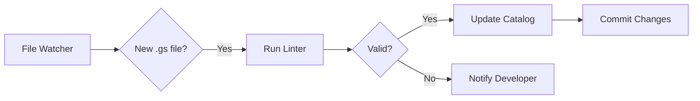

# Google Apps Script Linter and Documentation Automation Plan

## Overview
This plan outlines the development of an automated linting system for Google Apps Scripts and a self-updating script catalog.

## Components

### 1. GAS Linter (gas-linter.js)
A comprehensive linting tool that validates Google Apps Scripts against our style guide.

### 2. Script Catalog Generator (gas-catalog.js)
Automatically generates and maintains a catalog of all scripts in the repository.

### 3. Pre-commit Hook
Ensures all scripts pass linting before commits.

### 4. CI/CD Integration
Runs linting and catalog updates in the build pipeline.

## GAS Linter Design

### Core Features
```javascript
// gas-linter.js structure
class GASLinter {
  // Validation Rules
  validateHeader() {}        // Check header completeness
  validateSummary() {}       // Verify script summary
  validateFunctions() {}     // Check function documentation
  validateFormatting() {}    // Verify code formatting
  validateNaming() {}        // Check naming conventions
  validateStructure() {}     // Verify file structure
  validateSetup() {}         // Ensure setup instructions exist
  validatePerformance() {}   // Check for performance issues
  
  // Reporting
  generateReport() {}        // Create detailed lint report
  generateSummary() {}       // Quick pass/fail summary
  suggestFixes() {}         // Provide fix suggestions
}
```

### Validation Rules

#### 1. Header Validation
- Title exists and is descriptive
- Service is valid Google service
- Purpose is clear and concise
- Dates are in YYYY-MM-DD format
- Author and contact info present
- License specified

#### 2. Summary Validation
- Purpose section exists
- Description is comprehensive
- Problem solved is clear
- Success criteria defined
- At least 3 key features listed
- Services used are listed
- Setup has at least 3 steps

#### 3. Function Documentation
- All functions have JSDoc comments
- Parameters are documented with types
- Return values are documented
- Examples provided for complex functions
- Error conditions documented

#### 4. Code Quality Checks
- No var declarations (use const/let)
- Consistent 2-space indentation
- Proper bracket placement
- No trailing whitespace
- Line length under 100 characters
- Proper spacing around operators

#### 5. Performance Checks
- Warn about loops with API calls
- Suggest batch operations
- Check for unnecessary service calls
- Validate caching usage

### Severity Levels
- **ERROR**: Must fix (blocks commit)
- **WARNING**: Should fix (allows commit)
- **INFO**: Suggestions for improvement

## Script Catalog Design

### Catalog Structure
```markdown
# Google Apps Script Catalog

Last Updated: 2024-01-26 15:30:00

## Summary
- Total Scripts: 123
- By Service: Gmail (49), Drive (27), Sheets (13), ...
- Documentation Coverage: 85%
- Last Added: gmail-export-weekly.gs

## Scripts by Service

### Gmail Scripts (49)
| Script | Purpose | Features | Setup Complete | Last Updated |
|--------|---------|----------|----------------|--------------|
| gmail-export-advanced-sheets.gs | Export emails to sheets | Filtering, Attachments, Labels | ✅ | 2024-01-20 |
| ... | ... | ... | ... | ... |

### Drive Scripts (27)
...
```

### Catalog Features
1. **Automatic Discovery**: Finds all .gs files
2. **Metadata Extraction**: Parses headers for info
3. **Coverage Metrics**: Tracks documentation completeness
4. **Change Detection**: Identifies new/modified scripts
5. **Service Grouping**: Organizes by Google service
6. **Search Index**: Generates searchable keywords

## Implementation Timeline

### Phase 1: Linter Development (Week 1)
Day 1-2: Core linter structure
- Build rule engine
- Create validation functions
- Implement severity system

Day 3-4: Advanced validations
- Performance checks
- Security validations
- Best practice enforcement

Day 5: Reporting and fixes
- Generate detailed reports
- Suggest automatic fixes
- Create fix application system

### Phase 2: Catalog Generator (Week 2)
Day 1-2: Script discovery
- File system traversal
- Metadata extraction
- Change detection

Day 3-4: Catalog generation
- Markdown formatting
- Service categorization
- Coverage calculation

Day 5: Automation
- Watch for changes
- Auto-update catalog
- Generate diffs

### Phase 3: Integration (Week 3)
Day 1-2: Pre-commit hooks
- Git hook setup
- Local validation
- Error reporting

Day 3-4: CI/CD pipeline
- GitHub Actions workflow
- Cloud Build integration
- Automated PR checks

Day 5: Documentation
- Usage guides
- Configuration docs
- Troubleshooting

## When Linting Runs

### 1. Pre-commit (Local)
```bash
# .git/hooks/pre-commit
#!/bin/bash
node automation/dev-tools/gas-linter.js --staged
```

### 2. Pull Request (CI)
```yaml
# .github/workflows/gas-lint.yml
on:
  pull_request:
    paths:
      - 'apps/**/*.gs'
```

### 3. Scheduled (Daily)
```yaml
# .github/workflows/daily-lint.yml
on:
  schedule:
    - cron: '0 9 * * *'  # 9 AM daily
```

### 4. Manual Trigger
```bash
# Run locally
npm run lint:gas

# Lint specific file
npm run lint:gas apps/gmail/src/example.gs

# Lint with auto-fix
npm run lint:gas -- --fix
```

## Automation Workflows

### 1. New Script Detection


### 2. Catalog Update Process
1. Detect file system changes
2. Parse new/modified scripts
3. Extract metadata
4. Update catalog markdown
5. Calculate new metrics
6. Commit if changes exist

### 3. PR Validation Flow
1. Detect .gs files in PR
2. Run linter on changed files
3. Post results as PR comment
4. Block merge if errors exist
5. Suggest fixes in comments

## Configuration

### .gaslintrc.json
```json
{
  "rules": {
    "header-required": "error",
    "summary-complete": "error",
    "function-docs": "error",
    "no-var": "error",
    "indent": ["error", 2],
    "max-line-length": ["warning", 100],
    "batch-operations": "warning",
    "setup-instructions": "error"
  },
  "ignore": [
    "apps/**/templates/**",
    "apps/**/legacy/**"
  ],
  "catalog": {
    "output": "docs/SCRIPT_CATALOG.md",
    "includeMetrics": true,
    "groupByService": true
  }
}
```

## Success Metrics
1. **Linting Coverage**: 100% of scripts validated
2. **Documentation**: >95% have complete headers
3. **Catalog Accuracy**: Always up-to-date
4. **Developer Adoption**: Pre-commit hooks used
5. **Error Reduction**: <5% lint errors in PRs

## Next Steps
1. Create gas-linter.js implementation
2. Build catalog generator
3. Set up pre-commit hooks
4. Configure GitHub Actions
5. Create developer documentation
6. Run pilot with team
7. Iterate based on feedback